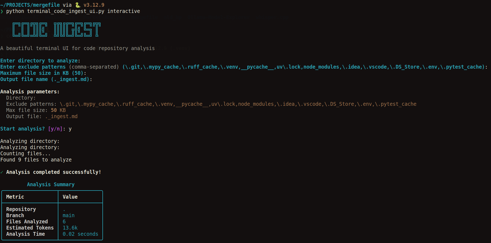
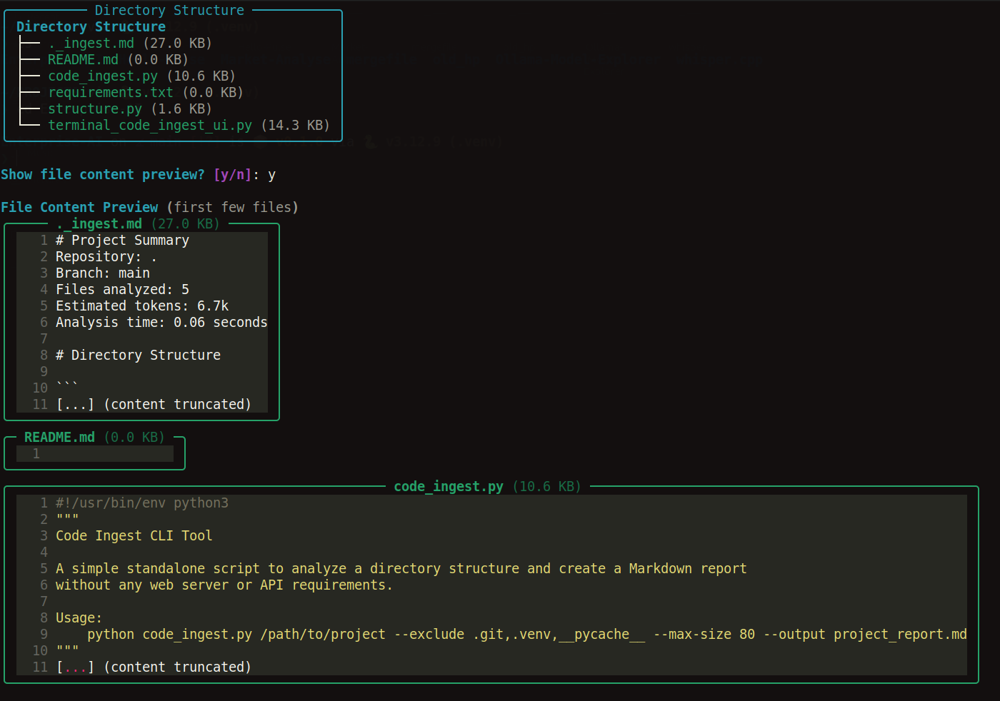
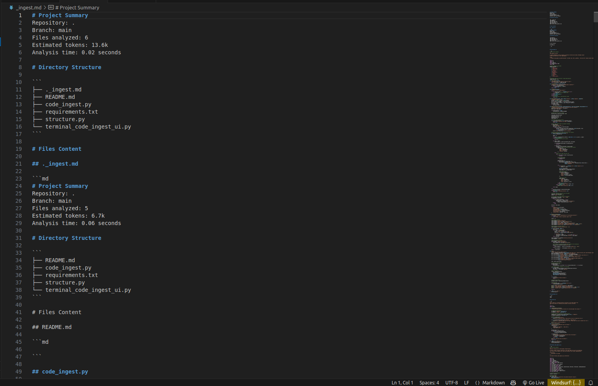

Here’s a **professional README** you can directly put in your GitHub repo (with your images included!):

---

# 🚀 Code Ingest

A **beautiful and fast** CLI and Terminal UI tool to **analyze any code repository** and automatically generate a **Markdown report** with:
- 📂 Full directory structure
- 📜 Source code content preview
- 🔍 Project summary and statistics (tokens, files, etc.)

Designed for developers who want to quickly document, inspect, or prepare repositories for LLM ingestion or analysis.

---

## 📸 Demo

| Interactive Mode | Directory & File Preview |
| :--------------: | :----------------------: |
|  |  |

---

## ✨ Features

- Terminal-based **interactive** and **non-interactive** analysis
- Exclude common folders (`.git`, `__pycache__`, `node_modules`, etc.)
- Max file size limit to avoid huge files
- Detects binary files and skips them
- Generates a clean and structured `.md` report
- Beautiful terminal UI powered by **Rich** and **Typer**
- Fast performance with progress bars
- Syntax highlighting in previews
- Auto-detection of git branch name

---

## 🛠️ Installation

```bash
pip install rich typer
```

---

## 🚀 Usage

### CLI Mode

```bash
python code_ingest.py /path/to/your/project --exclude .git,.venv,__pycache__ --max-size 50 --output project_report.md
```

- `--exclude` → Patterns to skip
- `--max-size` → Max file size in KB
- `--output` → Output markdown filename

### Interactive Mode (Recommended)

```bash
python terminal_code_ingest_ui.py interactive
```

You will be guided through:
- Directory selection
- Exclude patterns
- Max file size
- Output file name
- Confirmation before starting analysis

---

## 📁 Example Generated Report

Here’s a small part of what the generated Markdown report looks like:



---

## 📦 Project Structure

```
├── README.md
├── code_ingest.py
├── requirements.txt
├── structure.py
└── terminal_code_ingest_ui.py
```

---

## 📋 Requirements

- Python 3.7+
- `rich`
- `typer`

Install with:

```bash
pip install -r requirements.txt
```

---

## 🧠 Why Use Code Ingest?

- Quickly understand large repositories.
- Prepare datasets for LLM ingestion or pre-processing.
- Create clean documentation with directory trees + code previews.
- Save time when onboarding new projects.

---

## 🧹 TODO / Future Improvements

- Export in **HTML** format
- Support for **multi-language** file parsing (auto-detect languages)
- Advanced **filtering options** (only `.py`, `.md`, etc.)

---

## 📜 License

This project is licensed under the **MIT License** – feel free to use it!

---

Would you like me to also prepare a **short GitHub description** + **tags** you can use when creating the repository? 🚀  
(For maximum visibility)