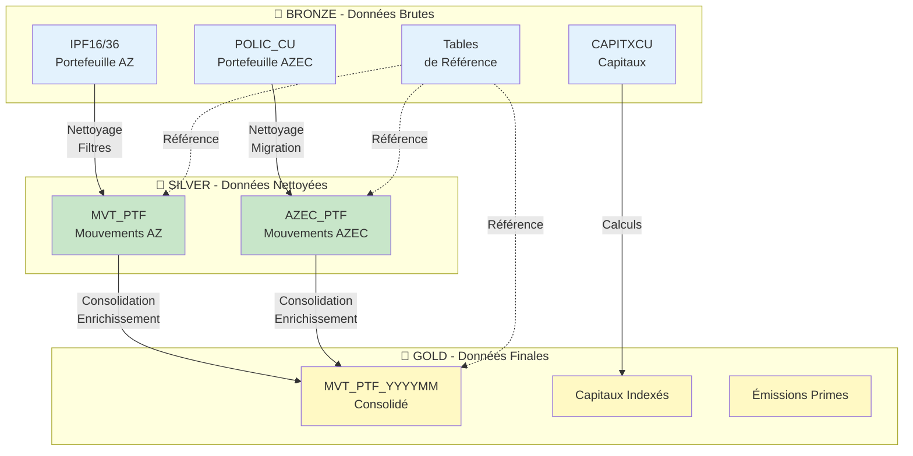

# 📚 Pipeline de Données Construction - Documentation

> **Pour comprendre le pipeline en 5 minutes** : Lisez cette page  
> **Public** : Équipes métier, analystes, développeurs juniors, chefs de projet

---

## 🎯 Qu'est-ce que ce Pipeline ?

Le **Pipeline de Données Construction** transforme automatiquement les données d'assurance brutes en informations exploitables pour :
- **Suivre le portefeuille** : Nouvelles polices, résiliations, renouvellements
- **Calculer les capitaux** : Montants assurés et indexation FFB
- **Analyser les primes** : Émissions mensuelles et annuelles

**En résumé** : Il prend des fichiers CSV désorganisés et produit des tables propres prêtes pour l'analyse.

---

## 🏗️ Architecture (Comment ça Marche ?)

### Modèle Bronze → Silver → Gold

Le pipeline suit une architecture en 3 couches appelée "Médaillon" :



### Explication des Couches

| Couche       | Rôle                                    | Exemple                                                 |
| ------------ | --------------------------------------- | ------------------------------------------------------- |
| **🥉 Bronze** | Stockage brut des fichiers d'origine    | `ipf16_202512.csv` tel quel                             |
| **🥈 Silver** | Données standardisées et nettoyées      | Colonnes typées, dates valides, doublons supprimés      |
| **🥇 Gold**   | Données métier enrichies et consolidées | Avec calculs d'exposition, capitaux indexés, codes ISIC |

**Pourquoi 3 couches ?**
- **Traçabilité** : On garde toujours l'original (Bronze)
- **Réutilisabilité** : Silver peut servir à plusieurs processus Gold
- **Performance** : Gold optimisé pour les requêtes analytiques

---

## 🚀 Démarrage Rapide

### Prérequis
- Python 3.8+
- PySpark 3.x
- Accès Azure Data Lake

### Exécution Standard

```bash
# Traiter la vision (mois) Décembre 2025
python main.py --vision 202512
```

**Ce qui se passe** :
1. ✅ Charge la configuration depuis `config/config.yml`
2. ✅ Exécute tous les pipelines activés (PTF_MVT, Capitaux, Émissions)
3. ✅ Écrit les résultats dans Gold
4. ✅ Upload les logs vers Azure

### Exécuter un Pipeline Spécifique

```bash
# Uniquement les mouvements de portefeuille
python main.py --component ptf_mvt --vision 202512

# Uniquement les capitaux
python main.py --component capitaux --vision 202512

# Uniquement les émissions
python main.py --component emissions --vision 202512
```

### Où Trouver les Résultats ?

Les données finales sont dans **Azure Data Lake Gold** :
```
abfs://shared@azfrdatalab.../gold/2025/12/
├── mvt_ptf_202512/          # Mouvements consolidés
├── capitaux_202512/         # Capitaux indexés
└── emissions_202512/        # Émissions de primes
```

---

## 📚 Documentation Détaillée

### Pour Comprendre les Calculs Métier

| Document                                                       | Contenu                                         | Quand l'utiliser ?                                    |
| -------------------------------------------------------------- | ----------------------------------------------- | ----------------------------------------------------- |
| **[📊 Calculs Assurance](calculs_assurance_construction.md)** ⭐ | Toutes les formules expliquées simplement       | Vous ne comprenez pas AFN, SMP, Exposition            |
| [🔄 Workflow PTF_MVT](workflows/ptf_mvt_workflow.md)            | Processus mouvements détaillé avec diagrammes   | Vous voulez savoir comment AZ et AZEC sont consolidés |
| [💰 Workflow Capitaux](workflows/Capitaux_Workflow.md)          | Processus extraction capitaux et indexation FFB | Vous travaillez sur les capitaux assurés              |
| [📄 Workflow Émissions](workflows/Emissions_Workflow.md)        | Processus calcul des primes émises              | Vous analysez les émissions de primes                 |

### Pour Configurer ou Modifier

| Document                                          | Contenu                                        | Quand l'utiliser ?                                 |
| ------------------------------------------------- | ---------------------------------------------- | -------------------------------------------------- |
| **[⚙️ Guide Utilisateur](GUIDE_UTILISATEUR.md)**   | Comment modifier les configurations SANS coder | Vous voulez changer un filtre, ajouter une colonne |
| [📂 Catalogue de Données](configs/Data_Catalog.md) | Référence complète des tables                  | Vous cherchez une table spécifique                 |

---

## 🔑 Concepts Clés (Glossaire Rapide)

### Mouvements de Portefeuille

| Terme                      | Signification                    | En pratique                           |
| -------------------------- | -------------------------------- | ------------------------------------- |
| **AFN** (Affaire Nouvelle) | Nouvelle police souscrite        | Un client signe aujourd'hui → AFN = 1 |
| **RES** (Résiliation)      | Police annulée ou non renouvelée | Client résilie → RES = 1              |
| **PTF** (Portefeuille)     | Police active sans mouvement     | Police continue normalement → PTF = 1 |

### Capitaux

| Terme                                    | Signification            | C'est quoi ?                           |
| ---------------------------------------- | ------------------------ | -------------------------------------- |
| **SMP** (Sinistre Maximum Possible)      | Pire sinistre imaginable | Si tout brûle, combien on paie max ?   |
| **LCI** (Limite Contractuelle Indemnité) | Montant max du contrat   | Ce qui est écrit au contrat            |
| **PE** (Perte d'Exploitation)            | Perte de revenus         | Si activité s'arrête, manque à gagner  |
| **RD** (Risque Direct)                   | Valeur des biens         | Combien valent les murs et équipements |

### Autres Termes

| Terme           | Signification                                                  |
| --------------- | -------------------------------------------------------------- |
| **Vision**      | Mois de traitement (format YYYYMM, ex: 202512 = Décembre 2025) |
| **Coassurance** | Plusieurs assureurs se partagent un même contrat               |
| **ISIC**        | Code international d'activité économique (comme NAF français)  |
| **FFB**         | Indice de construction pour indexer les capitaux               |

💡 **Pour les définitions complètes** : Voir [Calculs Assurance](calculs_assurance_construction.md)

---

## ⚡ Commandes Essentielles

```bash
# 1. Traitement standard
python main.py --vision 202512

# 2. Mode debug (logs détaillés)
# Modifiez config.yml : logging.level: "DEBUG"
python main.py --vision 202512

# 3. Utiliser config différente (test/prod)
python main.py --vision 202512 --config config/config_prod.yml

# 4. Forcer un seul composant
python main.py --component ptf_mvt --vision 202512

# 5. Utiliser variable d'environnement
export PIPELINE_VISION=202512
python main.py
```

---

## 🗂️ Structure du Projet

```
new_python/
├── main.py                      # 🚪 Point d'entrée
├── config/
│   ├── config.yml              # Configuration globale (chemins, Spark)
│   ├── reading_config.json     # Configuration lecture fichiers
│   ├── column_definitions.py   # Schémas des données
│   └── transformations/        # Règles métier (JSON)
├── src/
│   ├── reader.py               # Lecteur intelligent Bronze
│   ├── processors/             # Logique métier par pipeline
│   │   ├── ptf_mvt_processors/ # AZ, AZEC, Consolidation
│   │   ├── capitaux_processors/# Extraction capitaux
│   │   └── emissions_processors/# Calcul émissions
│   └── orchestrators.py        # Coordination des pipelines
├── utils/
│   ├── helpers.py              # Fonctions utilitaires
│   ├── loaders/                # Chargement configurations
│   └── transformations/        # Transformations réutilisables
└── docs/                       # 📚 Cette documentation
```

---

## 🆘 Besoin d'Aide ?

### Problèmes Courants

| Erreur                                    | Solution                                                         |
| ----------------------------------------- | ---------------------------------------------------------------- |
| `FileNotFoundError: Aucun fichier trouvé` | Vérifiez que les fichiers existent dans Bronze pour cette vision |
| `KeyError: vision`                        | Vérifiez que `--vision YYYYMM` est fourni                        |
| `Schema mismatch`                         | Vérifiez `column_definitions.py` et `reading_config.json`        |
| `Out of Memory`                           | Augmentez `spark.driver.memory` dans `config.yml`                |

### Où Chercher ?

1. **Comprendre un calcul** → [Calculs Assurance](calculs_assurance_construction.md)
2. **Modifier une config** → [Guide Utilisateur](GUIDE_UTILISATEUR.md)
3. **Comprendre un flux** → [Workflows](workflows/)
4. **Trouver une table** → [Catalogue Données](configs/Data_Catalog.md)

### Contact

- **Équipe Data Engineering** : Pour questions techniques
- **Documentation complète** : Voir fichiers markdown dans `/docs`

---

**Dernière Mise à Jour** : 11/02/2026  
**Version Pipeline** : 1.0  
**Compatibilité** : PySpark 3.x, Python 3.8+
