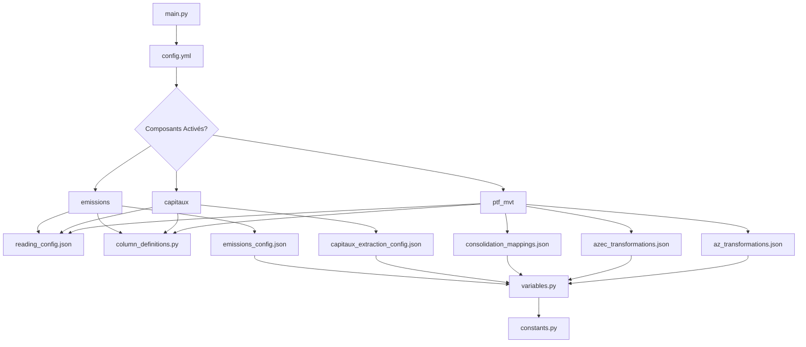

# Guide de Configuration du Pipeline

> **Guide complet pour configurer le pipeline Construction**  
> **Public** : Équipes métier, analystes, développeurs  
> **Dernière mise à jour** : 13/02/2026

---

## 📋 Table des Matières

1. [Vue d'Ensemble](#vue-densemble)
2. [config.yml - Configuration Globale](#configyml---configuration-globale)
3. [reading_config.json - Sources de Données](#reading_configjson---sources-de-données)
4. [column_definitions.py - Schémas](#column_definitionspy---schémas)
5. [Transformations JSON - Règles Métier](#transformations-json---règles-métier)
6. [constants.py & variables.py](#constantspy--variablespy)
7. [Exemples Pratiques](#exemples-pratiques)
8. [Troubleshooting](#troubleshooting)

---

## Vue d'Ensemble

### Organisation des Fichiers

```
config/
├── config.yml                    # ⚙️  Configuration globale (chemins, Spark, composants)
├── reading_config.json           # 📂 Définition des sources de données Bronze
├── column_definitions.py         # 📋 Schémas DDL pour toutes les tables
├── constants.py                  # 🔢 Constantes métier (DIRCOM, POLE, MARKET_CODE)
├── variables.py                  # 📦 Chargement centralisé des configs JSON
└── transformations/              # 🔄 Règles métier par pipeline
    ├── az_transformations.json            # Pipeline AZ
    ├── azec_transformations.json          # Pipeline AZEC
    ├── consolidation_mappings.json        # Pipeline Consolidation
    ├── business_rules.json                # Filtres métier globaux
    ├── capitaux_extraction_config.json    # Pipeline Capitaux
    └── emissions_config.json              # Pipeline Émissions
```

### Hiérarchie des Configurations



---

## config.yml - Configuration Globale

### Rôle

Fichier central du pipeline qui contrôle :
- **Chemins Azure Data Lake** (Bronze, Silver, Gold)
- **Composants activés/désactivés** (PTF_MVT, Capitaux, Émissions)
- **Paramètres Spark** (mémoire, partitions)
- **Logs** (niveau, format)

### Structure Complète

```yaml
# Métadonnées pipeline
pipeline:
  name: "Construction Data Pipeline"
  version: "1.0"
  description: "Pipeline mouvements de portefeuille"

# Format vision (YYYYMM)
vision:
  format: "YYYYMM"
  validation:
    min_year: 2000
    max_year: 2100

# Vision par défaut (peut être overridé par --vision CLI)
runtime:
  vision_: "202512"

# Environnement
environment:
  # Container ADLS (override via DATALAKE_CONTAINER env var)
  container: "abfs://shared@azfrdatalab.dfs.core.windows.net"

# Chemins Data Lake
datalake:
  # Racine stable (change rarement)
  data_root: "/ABR/P4D/ADC/DATAMARTS/CONSTRUCTION"
  
  # Templates de chemins (utilise {container}, {data_root}, {year}, {month})
  paths:
    bronze_monthly: "{container}{data_root}/bronze/{year}/{month}"
    bronze_reference: "{container}{data_root}/bronze/ref"
    silver: "{container}{data_root}/silver/{year}/{month}"
    gold: "{container}{data_root}/gold/{year}/{month}"

# Écriture (Silver & Gold)
output:
  clean: true               # Nettoyer les fichiers temporaires
  format: "delta"           # Delta Lake (ACID transactions)
  compression: "snappy"     # Compression (snappy recommandé)
  mode: "overwrite"         # overwrite | append
  vacuum_hours: 336         # Rétention 14 jours (Delta vacuum)

# Composants activés/désactivés
components:
  ptf_mvt:
    enabled: false          # Pipeline mouvements portefeuille
    description: "Mouvements de portefeuille (AZ + AZEC)"
  
  capitaux:
    enabled: false          # Pipeline capitaux
    description: "Extraction capitaux (SMP/LCI)"
  
  emissions:
    enabled: true           # Pipeline émissions
    description: "Traitement émissions"

# Configuration Spark
spark:
  app_name: "Construction_Pipeline"
  config:
    # Exécution adaptative
    "spark.sql.adaptive.enabled": "true"
    "spark.sql.adaptive.coalescePartitions.enabled": "true"
    "spark.sql.files.maxPartitionBytes": "134217728"  # 128MB
    
    # Mémoire (ajuster selon cluster)
    "spark.driver.memory": "4g"
    "spark.executor.memory": "8g"
    
    # Compatibilité Parquet
    "spark.sql.parquet.datetimeRebaseModeInWrite": "CORRECTED"

# Logs
logging:
  level: "INFO"             # DEBUG | INFO | WARNING | ERROR | CRITICAL
  format: "%(asctime)s - %(name)s - %(levelname)s - %(message)s"
  date_format: "%Y-%m-%d %H:%M:%S"
  local_dir: "logs"
  filename_template: "pipeline_{vision}.log"
```

### Modifications Courantes

#### 1. Changer l'Environnement (Dev → Prod)

```yaml
# AVANT (Dev)
environment:
  container: "abfs://dev@azfrdatalab.dfs.core.windows.net"

# APRÈS (Prod)
environment:
  container: "abfs://shared@azfrdatalab.dfs.core.windows.net"
```

**Ou via variable d'environnement** :
```bash
export DATALAKE_CONTAINER="abfs://shared@azfrdatalab.dfs.core.windows.net"
python main.py --vision 202512
```

#### 2. Activer/Désactiver Composants

```yaml
components:
  ptf_mvt:
    enabled: true   # ✅ Activé
  capitaux:
    enabled: false  # ❌ Désactivé
  emissions:
    enabled: true   # ✅ Activé
```

#### 3. Augmenter Mémoire Spark (Out of Memory)

```yaml
spark:
  config:
    "spark.driver.memory": "8g"       # 4g → 8g
    "spark.executor.memory": "16g"    # 8g → 16g
```

#### 4. Activer Logs Debug

```yaml
logging:
  level: "DEBUG"  # INFO → DEBUG
```

---

## reading_config.json - Sources de Données

### Rôle

Définit **QUELS fichiers lire** et **COMMENT les interpréter** depuis la couche Bronze.

### Structure Globale

```json
{
  "file_groups": {
    "nom_groupe": {
      "description": "Description métier du fichier",
      "file_patterns": ["pattern1.csv", "pattern2.csv"],
      "dynamic_columns": [...],
      "schema": "nom_schema_dans_column_definitions",
      "read_options": {...},
      "filters": [...],
      "location_type": "monthly" | "reference"
    }
  }
}
```

### Exemple Complet : Fichier IPF

```json
{
  "file_groups": {
    "ipf": {
      "description": "Fichiers de portefeuille agents (Pôle 1) et courtiers (Pôle 3)",
      
      "file_patterns": [
        "ipf16.csv",    // Agents
        "ipf36.csv"     // Courtage
      ],
      
      "dynamic_columns": [
        {
          "pattern": "*16*",   // Si nom fichier contient "16"
          "columns": {
            "cdpole": "1"      // Ajouter colonne cdpole="1"
          }
        },
        {
          "pattern": "*36*",   // Si nom fichier contient "36"
          "columns": {
            "cdpole": "3"      // Ajouter colonne cdpole="3"
          }
        }
      ],
      
      "schema": "ipf",  // Référence IPF_SCHEMA dans column_definitions.py
      
      "read_options": {
        "sep": "|",              // Séparateur colonnes
        "header": true,          // Première ligne = noms colonnes
        "encoding": "LATIN9",    // Encodage (LATIN9 = ISO-8859-15)
        "dateFormat": "dd/MM/yyyy"
      },
      
      "filters": [],  // Filtres appliqués après lecture (vide ici)
      
      "location_type": "monthly"  // bronze/{year}/{month}/
    }
  }
}
```

### Concepts Clés

#### 1. **file_patterns** : Patterns de Fichiers

Supporte wildcards :
- `ipf16.csv` : Fichier exact
- `ipf*.csv` : Tous fichiers commençant par "ipf"
- `*_202512.csv` : Tous fichiers se terminant par "_202512.csv"

#### 2. **dynamic_columns** : Colonnes Injectées

**Problème** : Comment distinguer les données de `ipf16.csv` et `ipf36.csv` après fusion ?

**Solution** : Ajouter automatiquement une colonne selon le nom du fichier.

```json
"dynamic_columns": [
  {
    "pattern": "*16*",      // Si fichier contient "16"
    "columns": {
      "cdpole": "1",        // Ajouter cdpole="1" à TOUTES les lignes
      "source": "agents"
    }
  }
]
```

**Résultat** :
| nopol | nom_client | cdpole | source |
| ----- | ---------- | ------ | ------ |
| AB123 | Dupont     | 1      | agents |

#### 3. **schema** : Référence au Schéma

Pointe vers une constante dans `column_definitions.py` :

```json
"schema": "ipf"
```

→ Utilise `IPF_SCHEMA` défini dans `column_definitions.py`

#### 4. **location_type** : Type de Localisation

| Valeur        | Emplacement              | Exemple                      |
| ------------- | ------------------------ | ---------------------------- |
| `"monthly"`   | `bronze/{year}/{month}/` | `bronze/2025/12/ipf16.csv`   |
| `"reference"` | `bronze/ref/`            | `bronze/ref/mapping_naf.csv` |

#### 5. **read_options** : Options de Lecture

| Option       | Description                    | Valeurs Courantes                     |
| ------------ | ------------------------------ | ------------------------------------- |
| `sep`        | Séparateur colonnes            | `"│"` (pipe), `","` (virgule), `";"`  |
| `header`     | Première ligne = noms colonnes | `true` / `false`                      |
| `encoding`   | Encodage caractères            | `"LATIN9"`, `"UTF-8"`, `"ISO-8859-1"` |
| `dateFormat` | Format dates                   | `"dd/MM/yyyy"`, `"yyyy-MM-dd"`        |

### Modifications Courantes

#### Ajouter un Nouveau Fichier

```json
{
  "file_groups": {
    "nouveau_fichier": {
      "description": "Description du nouveau fichier",
      "file_patterns": ["nouveau_fichier_{vision}.csv"],
      "schema": "nouveau_schema",  // À définir dans column_definitions.py
      "read_options": {
        "sep": "|",
        "header": true,
        "encoding": "UTF-8"
      },
      "location_type": "monthly"
    }
  }
}
```

#### Changer l'Encodage (Problème Accents)

```json
// AVANT (erreur accents)
"read_options": {
  "encoding": "UTF-8"
}

// APRÈS (accents corrigés)
"read_options": {
  "encoding": "LATIN9"  // ou ISO-8859-15
}
```

#### Ajouter un Filtre Après Lecture

```json
"filters": [
  {
    "column": "statut",
    "operator": "==",
    "value": "ACTIF"
  },
  {
    "column": "annee",
    "operator": ">=",
    "value": 2020
  }
]
```

---

## column_definitions.py - Schémas

### Rôle

Définit les **schémas DDL (Data Definition Language)** pour toutes les tables. Format PySpark.

### Structure

```python
# Format DDL (comme CREATE TABLE en SQL)
NOM_SCHEMA = """
    colonne1 TYPE,
    colonne2 TYPE,
    colonne3 TYPE
"""
```

### Types de Données Supportés

| Type PySpark | Description       | Exemple             |
| ------------ | ----------------- | ------------------- |
| `STRING`     | Texte             | "ABC123"            |
| `INT`        | Entier            | 2025                |
| `DOUBLE`     | Décimal           | 1234.56             |
| `DATE`       | Date (YYYY-MM-DD) | 2025-12-31          |
| `TIMESTAMP`  | Date + Heure      | 2025-12-31 14:30:00 |

### Exemple : Schéma IPF

```python
IPF_SCHEMA = """
    cdprod STRING,          -- Code produit
    nopol STRING,           -- Numéro de police
    noclt STRING,           -- Numéro client
    nmclt STRING,           -- Nom client
    noint STRING,           -- Numéro intermédiaire
    dtcrepol DATE,          -- Date création police
    dteffan DATE,           -- Date effet annuelle
    dtresilp DATE,          -- Date résiliation
    mtprprto DOUBLE,        -- Montant prime totale
    prcdcie DOUBLE,         -- Part compagnie (%)
    mtcafi DOUBLE,          -- Montant commission
    mtcapi1 DOUBLE,         -- Capital 1
    mtcapi2 DOUBLE,         -- Capital 2
    lbcapi1 STRING,         -- Libellé capital 1
    lbcapi2 STRING          -- Libellé capital 2
"""
```

### Modifications Courantes

#### 1. Ajouter une Colonne

```python
# AVANT
IPF_SCHEMA = """
    nopol STRING,
    nmclt STRING
"""

# APRÈS (ajout nouvelle_colonne)
IPF_SCHEMA = """
    nopol STRING,
    nmclt STRING,
    nouvelle_colonne STRING    -- Nouvelle colonne ajoutée
"""
```

> [!IMPORTANT]
> Le nom de colonne dans le schéma DOIT **exactement** correspondre au nom dans le fichier CSV (insensible à la casse).

#### 2. Changer le Type d'une Colonne

```python
# AVANT (erreur : montant lu comme texte)
IPF_SCHEMA = """
    montant STRING
"""

# APRÈS (montant = nombre décimal)
IPF_SCHEMA = """
    montant DOUBLE
"""
```

#### 3. Retirer une Colonne

```python
# AVANT
IPF_SCHEMA = """
    nopol STRING,
    colonne_inutile STRING,   -- À supprimer
    nmclt STRING
"""

# APRÈS
IPF_SCHEMA = """
    nopol STRING,
    nmclt STRING              -- colonne_inutile supprimée
"""
```

---

## Transformations JSON - Règles Métier

### Vue d'Ensemble

Les 6 fichiers JSON dans `config/transformations/` définissent les **règles métier** appliquées aux données.

| Fichier                           | Pipeline      | Contenu                                                |
| --------------------------------- | ------------- | ------------------------------------------------------ |
| `az_transformations.json`         | AZ            | Renommages, calculs capitaux, segmentation             |
| `azec_transformations.json`       | AZEC          | Mapping capitaux (branches), liste produits, migration |
| `consolidation_mappings.json`     | Consolidation | Harmonisation AZ/AZEC, flags, enrichissements          |
| `business_rules.json`             | Tous          | Filtres métier (CMARCH=6, CSEG=2)                      |
| `capitaux_extraction_config.json` | Capitaux      | Mots-clés extraction SMP/LCI/PE/RD                     |
| `emissions_config.json`           | Émissions     | Mapping garanties, calculs temporels                   |

### Structure Commune

```json
{
  "column_selection": {
    "rename": {...},        // Renommer colonnes
    "computed": {...}       // Calculer nouvelles colonnes
  },
  
  "transformations": [...],  // Liste transformations à appliquer
  
  "business_rules": {...}   // Règles métier spécifiques
}
```

### Exemples Détaillés

#### 1. az_transformations.json - Renommage Colonnes

```json
{
  "column_selection": {
    "rename": {
      "dtcrepol": "dtcre",    // Date création police → dtcre
      "dtresilp": "dtresil",  // Date résiliation → dtresil
      "nmclt": "nom_client"   // Nom client → nom_client
    }
  }
}
```

#### 2. azec_transformations.json - Mapping Capitaux

```json
{
  "capital_mapping": {
    "mappings": [
      {
        "capital_type": "SMP_PE_100",        // Sinistre Max Possible Perte Exploitation
        "source_column": "mnt_SMP",
        "filter_branches": ["01", "02", "04"], // Branches PE
       "operation": "sum"
      },
      {
        "capital_type": "SMP_DD_100",        // Sinistre Max Possible Dommages Directs
        "source_column": "mnt_SMP",
        "filter_branches": ["03", "05"],     // Branches DD
        "operation": "sum"
      }
    ]
  }
}
```

**Explication** :
- CAPITXCU contient plusieurs lignes par police (une par branche)
- On agrège par type de capital (PE vs DD)
- `SMP_100 = SMP_PE_100 + SMP_DD_100`

#### 3. business_rules.json - Filtres Métier

```json
{
  "business_filters": {
    "az": {
      "filters": [
        {
          "column": "cmarch",
          "type": "equals",
          "value": "6",              // Marché Construction
          "description": "Filtre marché Construction"
        },
        {
          "column": "cseg",
          "type": "equals",
          "value": "2",              // Segment 2
          "description": "Filtre segment 2"
        }
      ]
    }
  }
}
```

#### 4. capitaux_extraction_config.json - Mots-Clés

```json
{
  "capital_keywords": {
    "SMP_100": {
      "keywords": [
        "SMP GLOBAL",
        "SMP RETENU",
        "SINISTRE MAXIMUM POSSIBLE"
      ],
      "priority": 1
    },
    "LCI_100": {
      "keywords": [
        "LCI GLOBAL",
        "CAPITAL REFERENCE",
        "LIMITE CONTRACTUELLE"
      ],
      "priority": 2
    }
  }
}
```

**Utilisation** :
Le code parcourt les 14 colonnes `LBCAPI1` à `LBCAPI14` et cherche ces mots-clés. Si trouvé, extrait le capital correspondant depuis `MTCAPI_i`.

#### 5. consolidation_mappings.json - Flags

```json
{
  "transformations": {
    "computed": [
      {
        "column": "top_partenariat",
        "type": "flag",
        "condition_sql": "noint IN ('4A6160', '4A6947', '4A6956')"
      },
      {
        "column": "top_berlioz",
        "type": "flag",
        "condition_sql": "noint = '4A5766'"
      }
    ]
  }
}
```

**Résultat** :
- `top_partenariat = 1` si `noint` dans la liste, sinon `0`
- `top_berlioz = 1` si `noint = 4A5766`, sinon `0`

### Types de Transformations Supportées

| Type         | Description         | Exemple                       |
| ------------ | ------------------- | ----------------------------- |
| `rename`     | Renommer colonne    | `{"old": "new"}`              |
| `computed`   | Calculer colonne    | Formules, mapping, flags      |
| `flag`       | Colonne binaire 0/1 | Conditions SQL                |
| `mapping`    | Mappage valeurs     | `{"A": "Alpha", "B": "Beta"}` |
| `expression` | Expression PySpark  | `col("prix") * 1.2`           |

---

## constants.py & variables.py

### constants.py - Constantes Métier

**Rôle** : Constantes immuables utilisées dans le code.

```python
class DIRCOM:
    """Directions commerciales"""
    AZ = "AZ"        # Agents + Courtiers
    AZEC = "AZEC"    # Construction

class POLE:
    """Canaux de distribution"""
    AGENT = "1"      # Agents
    COURTAGE = "3"   # Courtage

class MARKET_CODE:
    """Codes marché"""
    MARKET = "6"     # Construction
    SEGMENT = "2"    # Segment 2
```

**Utilisation** :
```python
from config.constants import DIRCOM, POLE

df = df.withColumn("dircom", lit(DIRCOM.AZ))
df = df.filter(col("cdpole") == POLE.AGENT)
```

### variables.py - Chargement Centralisé

**Rôle** : Charge les configs JSON et les expose comme variables Python.

```python
from utils.loaders import get_default_loader

loader = get_default_loader()

# Charge az_transformations.json
az_config = loader.get_az_config()
AZ_COLUMN_CONFIG = az_config["column_selection"]

# Charge azec_transformations.json
azec_config = loader.get_azec_config()
AZEC_CAPITAL_MAPPING = azec_config["capital_mapping"]["mappings"]
```

**Utilisation** :
```python
from config.variables import AZ_COLUMN_CONFIG, AZEC_CAPITAL_MAPPING

# Accès direct aux configs
rename_map = AZ_COLUMN_CONFIG["rename"]
capital_map = AZEC_CAPITAL_MAPPING
```

---

## Exemples Pratiques

### Exemple 1 : Ajouter un Nouveau Filtre Métier

**Besoin** : Exclure les polices avec `statut = "SUSPENDU"`

**1. Modifier `business_rules.json`** :
```json
{
  "business_filters": {
    "az": {
      "filters": [
        {
          "column": "cmarch",
          "type": "equals",
          "value": "6"
        },
        {
          "column": "statut",        // NOUVEAU filtre
          "type": "not_equals",
          "value": "SUSPENDU",
          "description": "Exclure polices suspendues"
        }
      ]
    }
  }
}
```

**2. Aucun code Python à modifier** ✅

**3. Relancer le pipeline** :
```bash
python main.py --vision 202512 --component ptf_mvt
```

---

### Exemple 2 : Ajouter une Colonne dans un Fichier CSV

**Besoin** : Le fichier `ipf16.csv` contient maintenant une colonne `email_client`

**1. Modifier `column_definitions.py`** :
```python
# AVANT
IPF_SCHEMA = """
    nopol STRING,
    nmclt STRING
"""

# APRÈS
IPF_SCHEMA = """
    nopol STRING,
    nmclt STRING,
    email_client STRING    -- AJOUT
"""
```

**2. Relancer le pipeline** :
```bash
python main.py --vision 202512
```

---

### Exemple 3 : Changer Mot-Clé Extraction Capital

**Besoin** : La FFB a changé le libellé "SMP GLOBAL" → "SMP TOTAL"

**1. Modifier `capitaux_extraction_config.json`** :
```json
{
  "capital_keywords": {
    "SMP_100": {
      "keywords": [
        "SMP TOTAL",         // NOUVEAU libellé
        "SMP GLOBAL",        // Garder ancien (rétrocompatibilité)
        "SMP RETENU"
      ]
    }
  }
}
```

**2. Relancer le pipeline** ✅

---

### Exemple 4 : Activer Logs Debug pour Investiguer

**Besoin** : Le pipeline échoue, on veut plus de détails

**1. Modifier `config.yml`** :
```yaml
logging:
  level: "DEBUG"  # INFO → DEBUG
```

**2. Relancer** :
```bash
python main.py --vision 202512 --component ptf_mvt
```

**3. Consulter logs** :
```bash
cat logs/pipeline_202512.log | grep ERROR
cat logs/pipeline_202512.log | grep -A 5 "Traceback"
```

---

## Troubleshooting

### Problème 1 : Fichier Non Trouvé

**Erreur** :
```
FileNotFoundError: Aucun fichier trouvé correspondant au pattern 'ipf16.csv' dans bronze/2025/12/
```

**Solutions** :

1. **Vérifier que le fichier existe** :
```bash
# Azure CLI
az storage blob list --account-name azfrdatalab --container shared \
  --prefix "ABR/P4D/ADC/DATAMARTS/CONSTRUCTION/bronze/2025/12/" | grep ipf16
```

2. **Vérifier le pattern dans `reading_config.json`** :
```json
"file_patterns": ["ipf16.csv"]  //Pattern exact
```

3. **Vérifier vision** :
```bash
python main.py --vision 202512  # Vérifier YYYYMM
```

---

### Problème 2 : Erreur de Schéma (Colonne Manquante)

**Erreur** :
```
AnalysisException: Column 'email_client' not found in schema
```

**Cause** : Colonne définie dans `column_definitions.py` mais absente du CSV

**Solutions** :

1. **Vérifier CSV** : La colonne existe-t-elle vraiment ?

2. **Retirer du schéma si colonne optionnelle** :
```python
IPF_SCHEMA = """
    nopol STRING,
    nmclt STRING
    -- email_client STRING  (commenté)
"""
```

---

### Problème 3 : Out of Memory

**Erreur** :
```
java.lang.OutOfMemoryError: Java heap space
```

**Solutions** :

1. **Augmenter mémoire Spark dans `config.yml`** :
```yaml
spark:
  config:
    "spark.driver.memory": "8g"      # 4g → 8g
    "spark.executor.memory": "16g"   # 8g → 16g
```

2. **Réduire partitions** :
```yaml
spark:
  config:
    "spark.sql.files.maxPartitionBytes": "268435456"  # 128MB → 256MB
```

---

### Problème 4 : Encoding (Accents Cassés)

**Problème** : `Dupont` devient `Dupø´t`

**Cause** : Mauvais encodage

**Solution** : Modifier `reading_config.json` :
```json
"read_options": {
  "encoding": "LATIN9"  // ou ISO-8859-15, UTF-8
}
```

**Encodages courants** :
- `UTF-8` : Standard moderne
- `LATIN9` (ISO-8859-15) : Français (€, œ)
- `ISO-8859-1` : Europe occidentale

---

### Problème 5 : Dates NULL ou Invalides

**Problème** : Dates apparaissent NULL alors qu'elles sont présentes dans le CSV

**Cause** : Format date incorrect

**Solution** :

1. **Vérifier format dans CSV** :
```
31/12/2025  → dd/MM/yyyy
2025-12-31  → yyyy-MM-dd
```

2. **Ajuster dans `reading_config.json`** :
```json
"read_options": {
  "dateFormat": "dd/MM/yyyy"  // Adapter selon format CSV
}
```

---

## Résumé : Quelle Config pour Quel Besoin ?

| Besoin                         | Fichier à Modifier                | Section                    |
| ------------------------------ | --------------------------------- | -------------------------- |
| Changer chemins Azure          | `config.yml`                      | `datalake.paths`           |
| Activer/Désactiver pipeline    | `config.yml`                      | `components`               |
| Augmenter mémoire Spark        | `config.yml`                      | `spark.config`             |
| Ajouter nouveau fichier source | `reading_config.json`             | `file_groups`              |
| Ajouter colonne à lire         | `column_definitions.py`           | Schéma concerné            |
| Changer filtre métier          | `business_rules.json`             | `business_filters`         |
| Modifier extraction capitaux   | `capitaux_extraction_config.json` | `capital_keywords`         |
| Ajouter flag consolidation     | `consolidation_mappings.json`     | `transformations.computed` |
| Changer mapping AZEC           | `azec_transformations.json`       | `capital_mapping`          |
| Renommer colonne AZ            | `az_transformations.json`         | `column_selection.rename`  |

---

**Dernière Mise à Jour** : 13/02/2026  
**Contributeurs** : Équipe Data Engineering  
**Questions** : Consulter [GUIDE_UTILISATEUR.md](../GUIDE_UTILISATEUR.md) ou équipe Data
