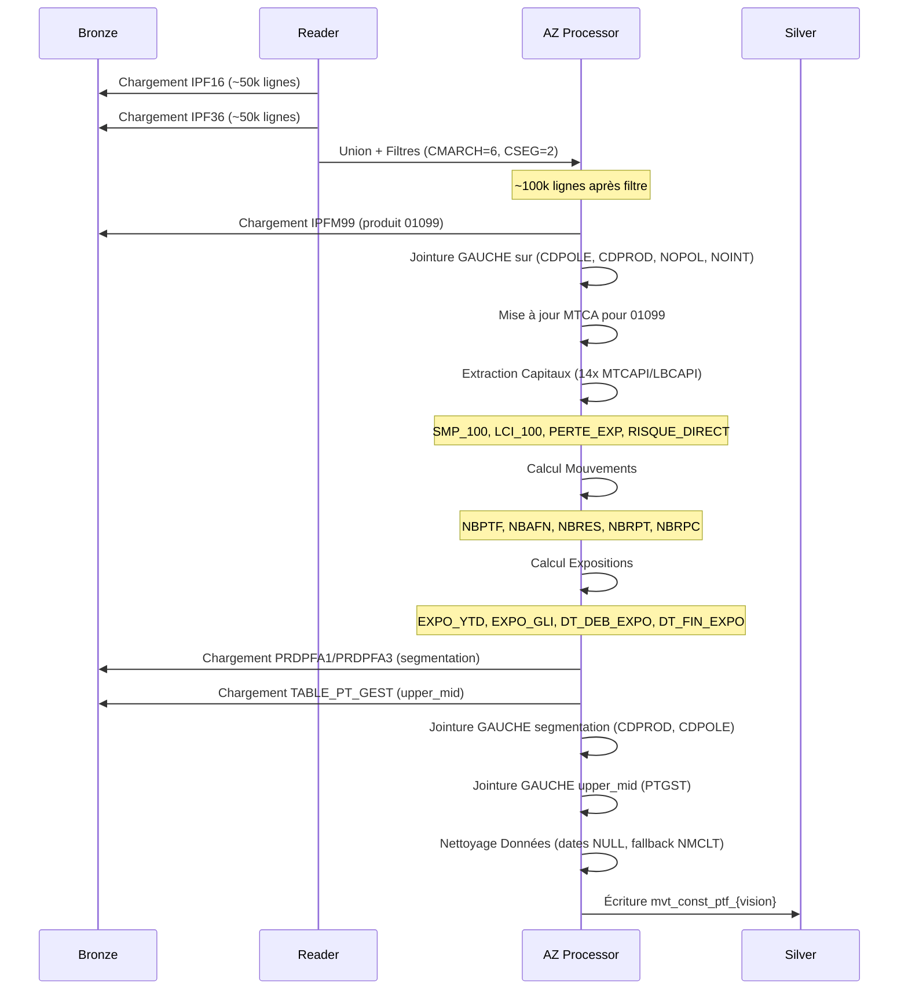
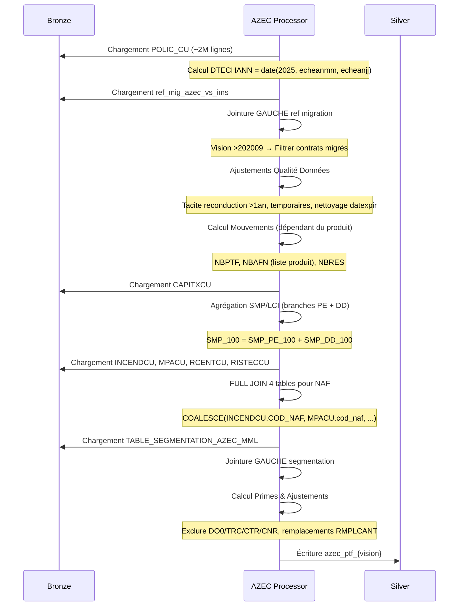
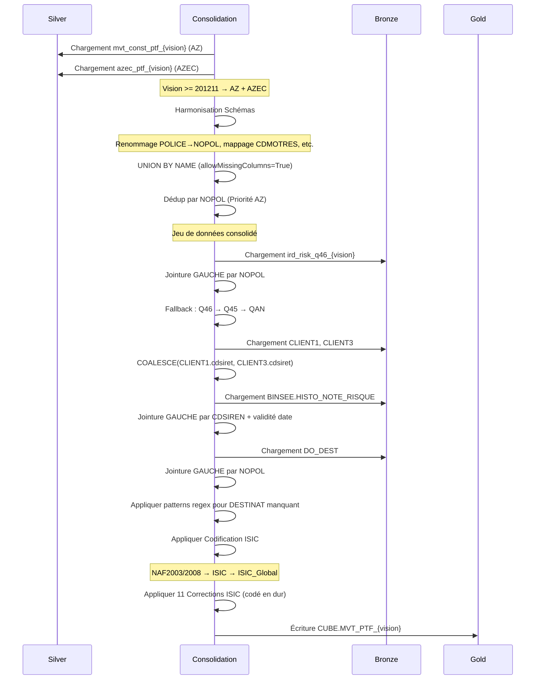
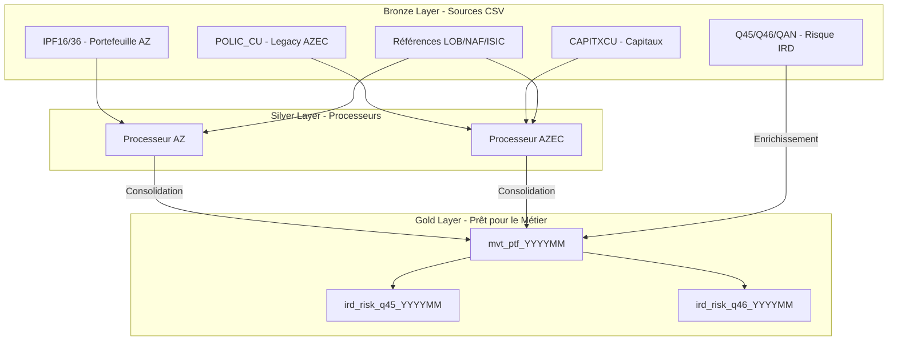

# Flux de Données - Pipelines PTF_MVT

> **Documentation technique des flux de données pour les 3 pipelines PTF_MVT**
> **Vision** : 202512 (Décembre 2025)

---

## 1. Pipeline AZ (Agent + Courtage)

### 1.1 Vue d'Ensemble

| Attribut            | Valeur                                             |
| ------------------- | -------------------------------------------------- |
| **Entrée Bronze**   | IPF16 (Agent), IPF36 (Courtage), IPFM99, PRDPFA1/3 |
| **Sortie Silver**   | `mvt_const_ptf_{vision}`                           |
| **Volume**          | Varie selon vision (marché Construction seulement) |
| **Temps Exécution** | ~2-3 min                                           |

### 1.2 Diagramme de Flux



### 1.3 Étapes Détaillées

| Étape | Méthode Python                       | Description                                        |
| ----- | ------------------------------------ | -------------------------------------------------- |
| 1     | `read()`                             | Extraction IPF16 + IPF36 avec filtres construction |
| 2     | `_join_ipfm99()`                     | Jointure IPFM99 pour produit 01099 (CA spécifique) |
| 3     | `transform()` - capitaux             | Calcul SMP/LCI/PE/RD (14 champs MTCAPI)            |
| 4     | `transform()` - mouvements           | Indicateurs NBPTF/NBAFN/NBRES/NBRPT/NBRPC          |
| 5     | `transform()` - expo                 | EXPO_YTD, EXPO_GLI, DT_DEB_EXPO, DT_FIN_EXPO       |
| 6     | `_enrich_segment_and_product_type()` | Segment2, type_produit_2, upper_mid                |
| 7     | `_finalize_data_cleanup()`           | Nettoyage dates NULL, fallback NMCLT               |

---

## 2. Pipeline AZEC (Construction Legacy)

### 2.1 Vue d'Ensemble

| Attribut            | Valeur                                                 |
| ------------------- | ------------------------------------------------------ |
| **Entrée Bronze**   | POLIC_CU, CAPITXCU, INCENDCU, MPACU, RCENTCU, RISTECCU |
| **Sortie Silver**   | `azec_ptf_{vision}`                                    |
| **Volume**          | Varie selon vision (filtre migration vision >202009)   |
| **Temps Exécution** | ~5-7 min                                               |

### 2.2 Diagramme de Flux



### 2.3 Étapes Spécifiques AZEC

| Étape | Méthode Python               | LOGIQUE CRITIQUE                                     |
| ----- | ---------------------------- | ---------------------------------------------------- |
| 1     | `read()`                     | DTECHANN = `date(annee, echeanmm, echeanjj)`         |
| 2     | `_handle_migration()`        | Vision >202009 : Jointure GAUCHE ref_mig_azec_vs_ims |
| 3     | `_update_dates_and_states()` | 4 règles qualité données (datexpir, tacite >1an)     |
| 4     | `_calculate_movements()`     | AFN/RES dépendants du PRODUIT (liste vs date)        |
| 5     | `_join_capitals()`           | Agrégation SMP/LCI (branches PE + DD)                |
| 6     | `_enrich_naf_codes()`        | **FULL JOIN 4 tables** → COALESCE priorité NAF       |
| 7     | `_adjust_nbres()`            | Exclure DO0/TRC/CTR/CNR, remplacements               |

---

## 3. Pipeline CONSOLIDATION (AZ + AZEC → Gold)

### 3.1 Vue d'Ensemble

| Attribut            | Valeur                              |
| ------------------- | ----------------------------------- |
| **Entrée Silver**   | mvt_const_ptf (AZ), azec_ptf (AZEC) |
| **Sortie Gold**     | `CUBE.MVT_PTF_{vision}`             |
| **Volume**          | AZ + AZEC consolidé (varie)         |
| **Temps Exécution** | ~8-10 min                           |

### 3.2 Diagramme de Flux



### 3.3 Logique Dépendante de la Vision

| Seuil Vision  | Logique                                           | Note                |
| ------------- | ------------------------------------------------- | ------------------- |
| **< 201211**  | AZ seul                                           | AZ seul             |
| **>= 201211** | Union AZ + AZEC                                   | AZ + AZEC consolidé |
| **< 202210**  | Utiliser RISK_REF 202210                          | Données réf fixes   |
| **>= 202210** | Utiliser RISK vision courante (ird_risk_{vision}) | Données mensuelles  |

### 3.4 Enrichissements Gold

| #   | Enrichissement         | Source Bronze                                            | Clé Jointure            | Logique Fallback                        |
| --- | ---------------------- | -------------------------------------------------------- | ----------------------- | --------------------------------------- |
| 1   | **Données Risque IRD** | ird_risk_q46/q45/qan_{vision}                            | NOPOL                   | Q46 → Q45 → QAN (cascade)               |
| 2   | **Client SIRET/SIREN** | cliact14 (CLIENT1), cliact3 (CLIENT3)                    | NOCLT                   | COALESCE(CLIENT1, CLIENT3)              |
| 3   | **Note Risque Euler**  | binsee_histo_note_risque                                 | CDSIREN + validité date | NULL si non trouvé                      |
| 4   | **Destinat**           | do_dest                                                  | NOPOL                   | Patterns regex si NULL                  |
| 5   | **Codification ISIC**  | mapping_cdnaf2003/2008_isic, table_isic_tre_naf, isic_lg | CDNAF + CDTRE           | Logique NAF2003/2008 + 11 fix hardcodés |
| 6   | **Produits Spéciaux**  | ipfm0024_1/3, ipfm63_1/3                                 | NOPOL + CDPROD          | Optionnel (si existe)                   |

---

## 4. Architecture Globale - Vue 3-Tiers



---

## 5. Points d'Attention par Pipeline

### 5.1 Pipeline AZ

| Point                    | Criticité | Description                                                          |
| ------------------------ | --------- | -------------------------------------------------------------------- |
| **Filtres Construction** | HAUTE     | CMARCH=6 ET CSEG=2 appliqués AVANT union                             |
| **Formule EXPO_YTD**     | CRITIQUE  | `(MIN(dtresilp, DTFIN) - MAX(dtcrepol, DTDEB_AN) + 1) / nbj_tot_ytd` |
| **Extraction Capitaux**  | HAUTE     | Boucle 14x MTCAPI/LBCAPI avec recherche mots-clés                    |
| **Segmentation**         | MOYENNE   | PRDPFA1 (Agent) vs PRDPFA3 (Courtage) sources différentes            |

### 5.2 Pipeline AZEC

| Point                | Criticité | Description                                                   |
| -------------------- | --------- | ------------------------------------------------------------- |
| **Filtre Migration** | CRITIQUE  | Vision >202009 → exclut contrats migrés vers IMS              |
| **NAF FULL JOIN**    | CRITIQUE  | FULL JOIN 4 tables (INCENDCU/MPACU/RCENTCU/RISTECCU)          |
| **Listes Produits**  | HAUTE     | 48 produits codés en dur pour logique AFN/RES                 |
| **Agrégation SMP**   | HAUTE     | `SMP_100 = SMP_PE_100 + SMP_DD_100` (branches PE + DD)        |
| **Qualité Données**  | MOYENNE   | 4 règles (datexpir, tacite >1an, temporaires, nettoyage NULL) |

### 5.3 Pipeline CONSOLIDATION

| Point                | Criticité | Description                                                          |
| -------------------- | --------- | -------------------------------------------------------------------- |
| **OUTER UNION CORR** | CRITIQUE  | `unionByName(allowMissingColumns=True)` reproduit logique historique |
| **Dédup par NOPOL**  | CRITIQUE  | Priorité AZ si NOPOL existe dans AZ et AZEC                          |
| **Corrections ISIC** | HAUTE     | 11 fix hardcodés (Legacy L577-590)                                   |
| **Dépendant Vision** | HAUTE     | <201211 (AZ seul), >=201211 (AZ+AZEC), <202210 (réf RISK)            |
| **Cascade IRD**      | MOYENNE   | Logique fallback Q46 → Q45 → QAN                                     |

---

## 6. Commandes Exécution

### 6.1 Python (Databricks / Local)

```bash
# Exécuter le pipeline complet pour la vision 202512
python main.py --vision 202512 --component ptf_mvt

# Exécuter des processeurs individuels (si implémenté via arguments)
# Note : Actuellement les composants regroupent les processeurs
python main.py --vision 202512 --component ptf_mvt
```

---

**Dernière Mise à Jour** : 06/02/2026
**Note** : Le nombre de lignes varie selon la vision (filtres Construction, migration AZEC, etc.)
