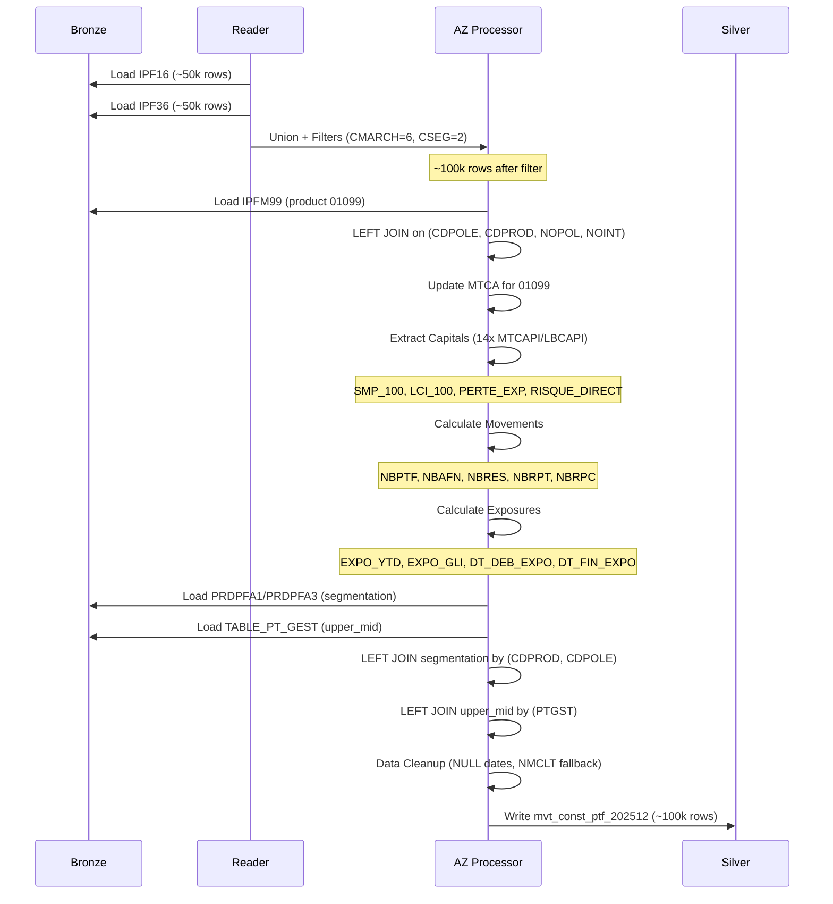
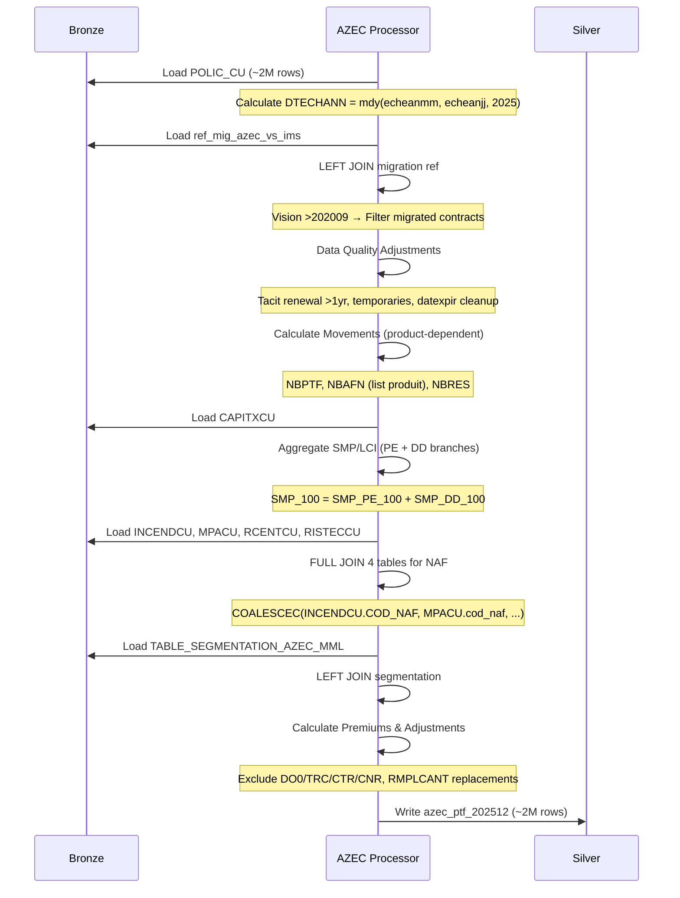
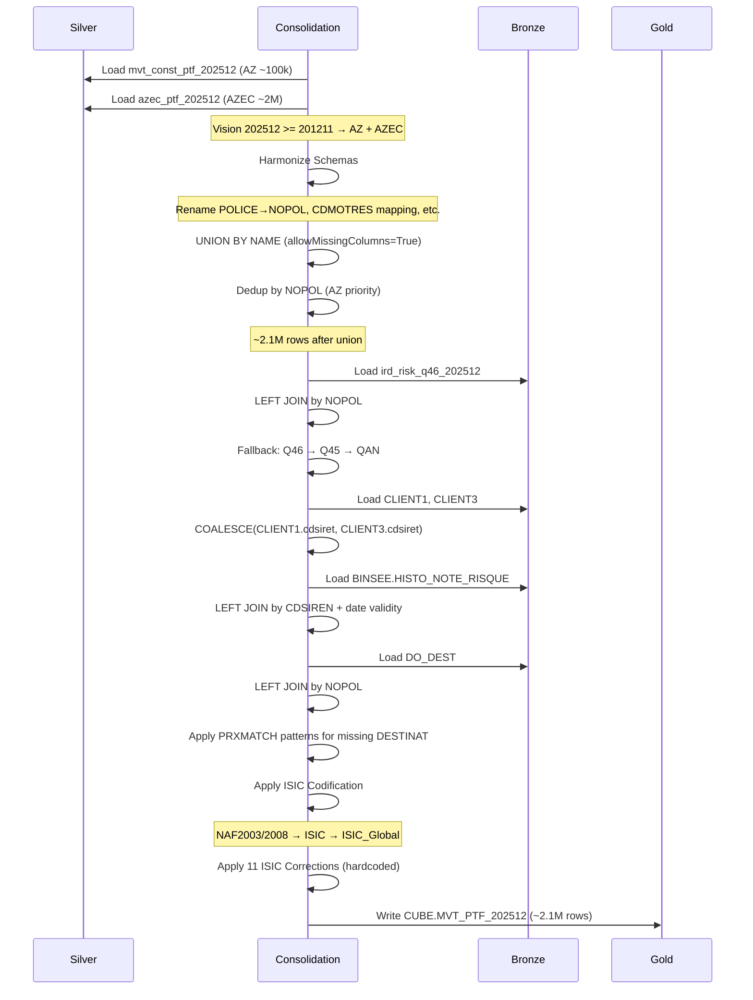
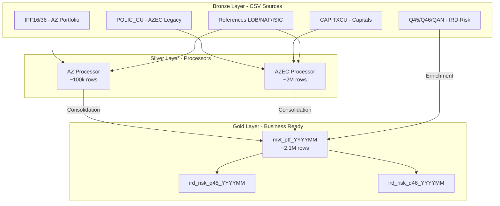

# Flux de Données - Pipelines PTF_MVT

> **Documentation technique des flux de données pour les 3 pipelines PTF_MVT**  
> **Vision**: 202512 (Décembre 2025)

---

## 1. Pipeline AZ (Agent + Courtage)

### 1.1 Vue d'Ensemble

| Attribut             | Valeur                                             |
| -------------------- | -------------------------------------------------- |
| **Input Bronze**     | IPF16 (Agent), IPF36 (Courtage), IPFM99, PRDPFA1/3 |
| **Output Silver**    | `mvt_const_ptf_{vision}`                           |
| **Volume (~202512)** | ~100k lignes                                       |
| **Temps Exécution**  | ~2-3 min                                           |

### 1.2 Diagramme de Flux



### 1.3 Étapes Détaillées

| Step | SAS Ligne | Python Méthode                       | Description                                     | Row Count |
| ---- | --------- | ------------------------------------ | ----------------------------------------------- | --------- |
| 1    | L135-150  | `read()`                             | Extract IPF16 + IPF36 avec filtres construction | ~100k     |
| 2    | L157-188  | `_join_ipfm99()`                     | Join IPFM99 pour produit 01099 (CA spécifique)  | ~100k     |
| 3    | L195-231  | `transform()` - capitals             | Calcul SMP/LCI/PE/RD (14 MTCAPI fields)         | ~100k     |
| 4    | L238-292  | `transform()` - movements            | NBPTF/NBAFN/NBRES/NBRPT/NBRPC indicators        | ~100k     |
| 5    | L298-311  | `transform()` - expo                 | EXPO_YTD, EXPO_GLI, DT_DEB_EXPO, DT_FIN_EXPO    | ~100k     |
| 6    | L377-503  | `_enrich_segment_and_product_type()` | Segment2, type_produit_2, upper_mid             | ~100k     |
| 7    | L362-370  | `_finalize_data_cleanup()`           | Cleanup NULL dates, NMCLT fallback              | ~100k     |

---

## 2. Pipeline AZEC (Legacy Construction)

### 2.1 Vue d'Ensemble

| Attribut             | Valeur                                                 |
| -------------------- | ------------------------------------------------------ |
| **Input Bronze**     | POLIC_CU, CAPITXCU, INCENDCU, MPACU, RCENTCU, RISTECCU |
| **Output Silver**    | `azec_ptf_{vision}`                                    |
| **Volume (~202512)** | ~2M lignes                                             |
| **Temps Exécution**  | ~5-7 min                                               |

### 2.2 Diagramme de Flux



### 2.3 Étapes Spécifiques AZEC

| Step | SAS Ligne | Python Méthode               | CRITICAL LOGIC                                      | Row Count |
| ---- | --------- | ---------------------------- | --------------------------------------------------- | --------- |
| 1    | L61       | `read()`                     | DTECHANN = `mdy(echeanmm, echeanjj, &annee.)`       | ~2M       |
| 2    | L94-106   | `_handle_migration()`        | Vision >202009: LEFT JOIN ref_mig_azec_vs_ims       | ~2M       |
| 3    | L113-137  | `_update_dates_and_states()` | 4 data quality rules (datexpir, tacit renewal >1yr) | ~2M       |
| 4    | L144-182  | `_calculate_movements()`     | PRODUIT-dependent AFN/RES (list vs date-based)      | ~2M       |
| 5    | L387-420  | `_join_capitals()`           | SMP/LCI agregation (PE + DD branches)               | ~2M       |
| 6    | L272-302  | `_enrich_naf_codes()`        | **FULL JOIN 4 tables** → COALESCEC NAF priority     | ~2M       |
| 7    | L448-466  | `_adjust_nbres()`            | Exclude DO0/TRC/CTR/CNR, replacements               | ~2M       |

---

## 3. Pipeline CONSOLIDATION (AZ + AZEC → Gold)

### 3.1 Vue d'Ensemble

| Attribut             | Valeur                              |
| -------------------- | ----------------------------------- |
| **Input Silver**     | mvt_const_ptf (AZ), azec_ptf (AZEC) |
| **Output Gold**      | `CUBE.MVT_PTF_{vision}`             |
| **Volume (~202512)** | ~2.1M lignes (AZ+AZEC)              |
| **Temps Exécution**  | ~8-10 min                           |

### 3.2 Diagramme de Flux



### 3.3 Vision-Dependent Logic

| Vision Threshold | Logique                                     | Row Impact         |
| ---------------- | ------------------------------------------- | ------------------ |
| **< 201211**     | AZ only                                     | ~100k              |
| **>= 201211**    | AZ + AZEC union                             | ~2.1M              |
| **< 202210**     | Use RISK_REF 202210                         | N/A (ref data)     |
| **>= 202210**    | Use current vision RISK (ird_risk_{vision}) | N/A (monthly data) |

### 3.4 Enrichissements Gold

| #   | Enrichissement         | Source Bronze                                            | Join Key                | Fallback Logic                          |
| --- | ---------------------- | -------------------------------------------------------- | ----------------------- | --------------------------------------- |
| 1   | **IRD Risk Data**      | ird_risk_q46/q45/qan_{vision}                            | NOPOL                   | Q46 → Q45 → QAN (waterfall)             |
| 2   | **Client SIRET/SIREN** | cliact14 (CLIENT1), cliact3 (CLIENT3)                    | NOCLT                   | COALESCE(CLIENT1, CLIENT3)              |
| 3   | **Euler Risk Note**    | binsee_histo_note_risque                                 | CDSIREN + date validity | NULL if not found                       |
| 4   | **Destinat**           | do_dest                                                  | NOPOL                   | PRXMATCH patterns if NULL               |
| 5   | **ISIC Codification**  | mapping_cdnaf2003/2008_isic, table_isic_tre_naf, isic_lg | CDNAF + CDTRE           | NAF2003/2008 logic + 11 hardcoded fixes |
| 6   | **Special Products**   | ipfm0024_1/3, ipfm63_1/3                                 | NOPOL + CDPROD          | Optional (if exists)                    |

---

## 4. Architecture Globale - Vue 3-Tiers



---

## 5. Points d'Attention par Pipeline

### 5.1 AZ Pipeline

| Point                    | Criticité | Description                                                          |
| ------------------------ | --------- | -------------------------------------------------------------------- |
| **Filtres Construction** | HIGH      | CMARCH=6 AND CSEG=2 appliqués AVANT union                            |
| **EXPO_YTD Formula**     | CRITICAL  | `(MIN(dtresilp, DTFIN) - MAX(dtcrepol, DTDEB_AN) + 1) / nbj_tot_ytd` |
| **Capital Extraction**   | HIGH      | Loop 14x MTCAPI/LBCAPI avec keyword matching                         |
| **Segmentation**         | MEDIUM    | PRDPFA1 (Agent) vs PRDPFA3 (Courtage) sources différentes            |

### 5.2 AZEC Pipeline

| Point                | Criticité | Description                                                       |
| -------------------- | --------- | ----------------------------------------------------------------- |
| **Migration Filter** | CRITICAL  | Vision >202009 → exclut contracts migrés vers IMS                 |
| **NAF FULL JOIN**    | CRITICAL  | FULL JOIN 4 tables (INCENDCU/MPACU/RCENTCU/RISTECCU)              |
| **Product Lists**    | HIGH      | 48 products hardcoded pour AFN/RES logic                          |
| **SMP Aggregation**  | HIGH      | `SMP_100 = SMP_PE_100 + SMP_DD_100` (PE + DD branches)            |
| **Data Quality**     | MEDIUM    | 4 rules (datexpir, tacit renewal >1yr, temporaries, NULL cleanup) |

### 5.3 CONSOLIDATION Pipeline

| Point                | Criticité | Description                                               |
| -------------------- | --------- | --------------------------------------------------------- |
| **OUTER UNION CORR** | CRITICAL  | `unionByName(allowMissingColumns=True)` reproduit SAS     |
| **Dedup by NOPOL**   | CRITICAL  | AZ priority si NOPOL existe dans AZ et AZEC               |
| **ISIC Corrections** | HIGH      | 11 hardcoded fixes (SAS L577-590)                         |
| **Vision-Dependent** | HIGH      | <201211 (AZ only), >=201211 (AZ+AZEC), <202210 (ref RISK) |
| **IRD Waterfall**    | MEDIUM    | Q46 → Q45 → QAN fallback logic                            |

---

## 6. Commandes Exécution

### 6.1 Python (Databricks)

```bash
# Run full pipeline for vision 202512
python main.py --vision 202512 --component ptf_mvt

# Run individual processors
python main.py --vision 202512 --component ptf_mvt --processor az
python main.py --vision 202512 --component ptf_mvt --processor azec
python main.py --vision 202512 --component ptf_mvt --processor consolidation
```

### 6.2 SAS (Enterprise Guide)

```sas
%let vision = 202512;
%let annee = 2025;
%let mois = 12;

%az_mvt_ptf(&annee., &mois.);
%azec_mvt_ptf(&vision.);
%consolidation_az_azec_mvt_ptf;
```

---

## 7. Validations Row Counts

| Pipeline   | Bronze Input     | Silver Output | Filtres Appliqués                    | Expected Loss % |
| ---------- | ---------------- | ------------- | ------------------------------------ | --------------- |
| **AZ**     | ~100k (IPF16+36) | ~100k         | Construction only (CMARCH=6, CSEG=2) | <1%             |
| **AZEC**   | ~2.5M (POLIC_CU) | ~2M           | Migration filter (vision >202009)    | ~20%            |
| **CONSOL** | ~2.1M (AZ+AZEC)  | ~2.1M         | Dedup by NOPOL (AZ priority)         | <1%             |

---

**Dernière Mise à Jour**: 2026-02-04  
**Vision Testée**: 202512 (Décembre 2025)
