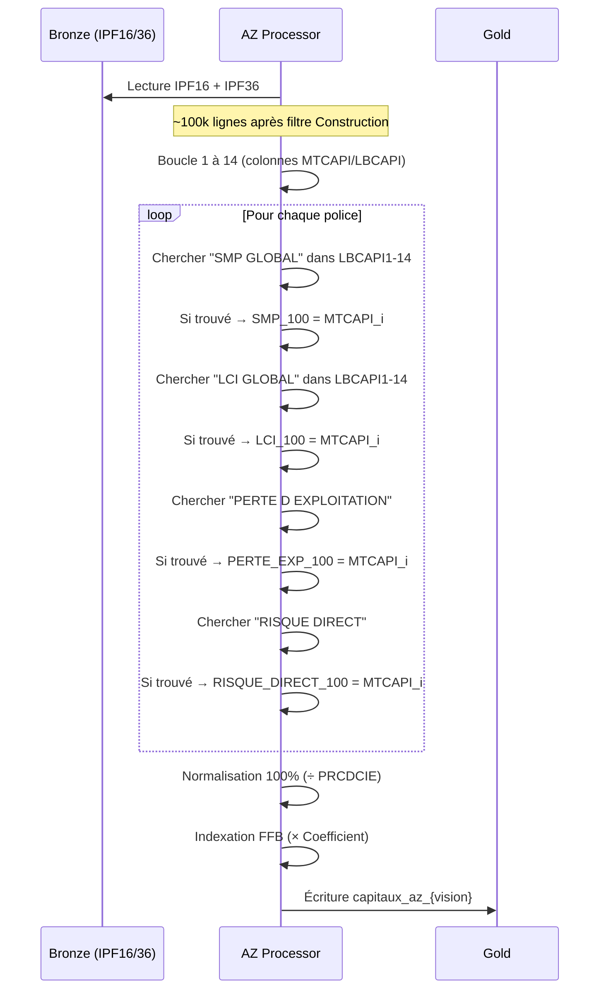
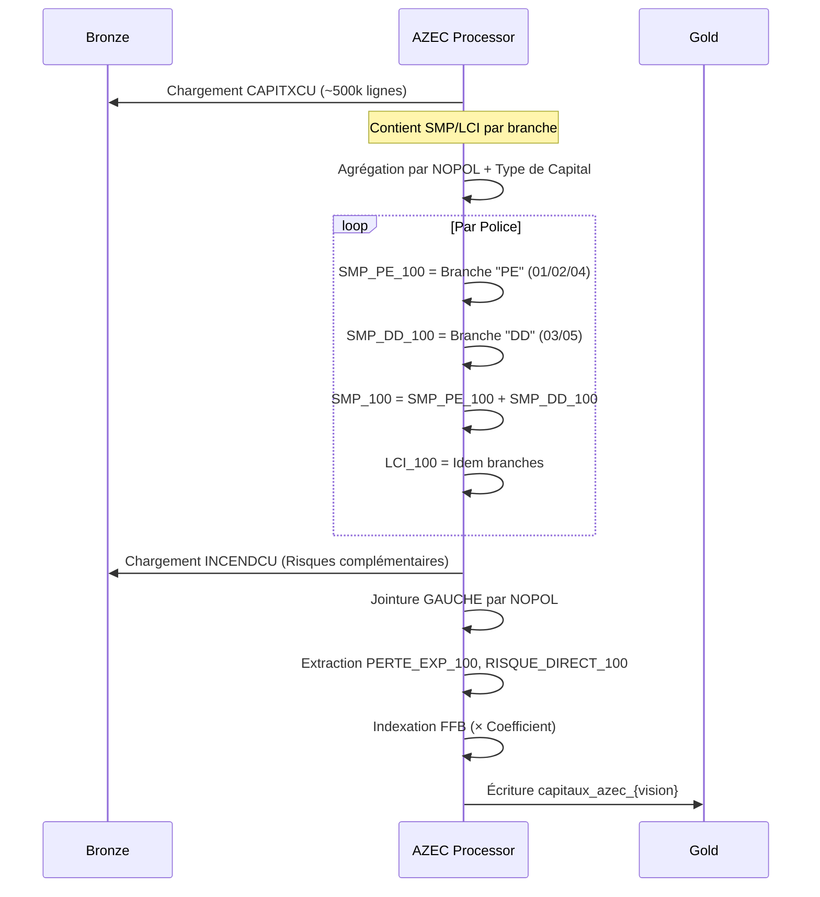

# Workflow Capitaux (Extraction et Indexation)

> **Documentation technique du flux de gestion des Capitaux Assurés**  
> **Objectif** : Consolider et indexer les garanties (SMP, LCI, PE, RD) issus de AZ et AZEC  
> **Vision** : 202512 (Décembre 2025)

---

## 1. Vue d'Ensemble

### 1.1 But Métier

**Pourquoi extraire les capitaux ?**

Les capitaux représentent l'engagement financier maximum de l'assureur en cas de sinistre. Le suivi précis de ces montants est essentiel pour :
- **Évaluer le risque** : Combien pourrait coûter le pire sinistre ?
- **Ajuster les tarifs** : Les capitaux élevés justifient des primes plus élevées
- **Respecter les régulations** : Calcul des réserves obligatoires (Solvabilité II)

### 1.2 Architecture Globale

```mermaid
graph TB
    subgraph "🥉 BRONZE - Sources de Capitaux"
        B1[IPF16/36<br/>14 colonnes MTCAPI/LBCAPI]
        B2[CAPITXCU<br/>Branches PE + DD]
        B3[Index FFB<br/>Coefficient d'inflation]
    end
    
    subgraph "🥈 SILVER - Extraction"
        S1[Capital AZ<br/>Extraction mots-clés]
        S2[Capital AZEC<br/>Agrégation branches]
    end
    
    subgraph "🥇 GOLD - Indexation & Consolidation"
        G1[Indexation FFB<br/>Prix actuels]
        G2[CAPITAUX_{vision}<br/>Indexés + Non-indexés]
    end
    
    B1 --> S1
    B2 --> S2
    B3 --> G1
    
    S1 --> G1
    S2 --> G1
    G1 --> G2
    
    style B1 fill:#e3f2fd
    style B2 fill:#e3f2fd
    style B3 fill:#e3f2fd
    style S1 fill:#c8e6c9
    style S2 fill:#c8e6c9
    style G1 fill:#fff9c4
    style G2 fill:#fff9c4
```

---

## 2. Pipeline AZ (Canal Agents & Courtiers)

### 2.1 Problématique

Les fichiers IPF16/36 contiennent **14 colonnes génériques** :
- `LBCAPI1` à `LBCAPI14` : Libellés (texte libre)
- `MTCAPI1` à `MTCAPI14` : Montants correspondants

**Challenge** : Aucune colonne fixe pour SMP, LCI, PE, RD. Il faut **chercher dans les 14 libellés**.

### 2.2 Diagramme de Flux



### 2.3 Règles d'Extraction

| Capital Cible         | Mots-clés Recherchés                                      | Priorité   |
| --------------------- | --------------------------------------------------------- | ---------- |
| **SMP_100**           | "SMP GLOBAL", "SMP RETENU", "SINISTRE MAXIMUM POSSIBLE"   | Priorité 1 |
| **LCI_100**           | "LCI GLOBAL", "CAPITAL REFERENCE", "LIMITE CONTRACTUELLE" | Priorité 2 |
| **PERTE_EXP_100**     | "PERTE D EXPLOITATION", "PERTE EXPLOITATION", "PE"        | Priorité 3 |
| **RISQUE_DIRECT_100** | "RISQUE DIRECT", "DOMMAGES DIRECTS", "RD"                 | Priorité 4 |

**Règle Importante** : Si un mot-clé apparaît plusieurs fois (ex: LBCAPI3 et LBCAPI12), **la dernière occurrence l'emporte** (index 14 prioritaire).

### 2.4 Normalisation 100%

Les montants bruts sont en coassurance (ex: si la compagnie a 60%, le capital affiché = 60% du total).

**Formule** :
```
Capital_100 = Capital_Brut × (100 / PRCDCIE)

Où PRCDCIE = Part Compagnie (%)
```

**Exemple** :
```
Montant affiché : 600 000 € (part compagnie 60%)
PRCDCIE = 60
→ SMP_100 = 600 000 € × (100/60) = 1 000 000 €
```

### 2.5 Indexation FFB

La **Fédération Française du Bâtiment (FFB)** publie un indice pour suivre l'évolution des coûts de construction.

**Pourquoi indexer ?**
Un chantier assuré en 2020 coûtera plus cher à reconstruire en 2025 (inflation des matériaux, main-d'œuvre).

**Formule** :
```
Capital_IND = Capital_100 × (Indice_Vision / Indice_Base)
```

**Exemple** :
```
SMP_100 (2020) = 1 000 000 €
Indice FFB 2020 = 100
Indice FFB 2025 = 115
→ SMP_100_IND = 1 000 000 × (115/100) = 1 150 000 €
```

---

## 3. Pipeline AZEC (Canal Construction)

### 3.1 Différence Fondamentale

Contrairement à AZ (extraction par mots-clés), AZEC fonctionne par **agrégation de tables dédiées**.

### 3.2 Diagramme de Flux



### 3.3 Logique d'Agrégation

**CAPITXCU contient plusieurs lignes par police** (une par branche de garantie).

**Codification des Branches** :
| Code | Nom                       | SMP | LCI |
| ---- | ------------------------- | --- | --- |
| 01   | Perte d'Exploitation (PE) | ✓   | ✓   |
| 02   | PE Complémentaire         | ✓   | ✓   |
| 03   | Dommages Directs (DD)     | ✓   | ✓   |
| 04   | PE Risques Spéciaux       | ✓   |     |
| 05   | DD Risques Spéciaux       | ✓   |     |

**Formules** :
```
SMP_PE_100 = SUM(CAPITAL où branche IN (01, 02, 04))
SMP_DD_100 = SUM(CAPITAL où branche IN (03, 05))
SMP_100 = SMP_PE_100 + SMP_DD_100
```

**Exemple** :
```
Police 123ABC a :
- Branche 01 (PE) : 300 000 €
- Branche 03 (DD) : 1 200 000 €
→ SMP_PE_100 = 300 000 €
→ SMP_DD_100 = 1 200 000 €
→ SMP_100 = 1 500 000 €
```

### 3.4 Point d'Attention : INCENDCU

**Fichier Optionnel** : Si absent ou vide, les champs PE/RD sont mis à `NULL` (pas d'erreur).

**Jointure** :
```python
LEFT JOIN INCENDCU ON CAPITXCU.nopol = INCENDCU.caract_cdpolcntecum
```

---

## 4. Consolidation (Gold)

### 4.1 Stratégie de Fusion

| Vision        | Logique                             |
| ------------- | ----------------------------------- |
| **< 201211**  | AZ uniquement (AZEC n'existait pas) |
| **>= 201211** | UNION(AZ, AZEC) avec priorité AZ    |

**Règle de Dédoublonnage** :
```
Si NOPOL existe dans AZ ET AZEC :
    → Garder AZ
    → Ignorer AZEC
```

**Pourquoi ?** AZ est considéré comme la source de vérité car plus fréquemment mise à jour.

### 4.2 Harmonisation des Colonnes

| Colonne       | AZ     | AZEC | Solution            |
| ------------- | ------ | ---- | ------------------- |
| `smp_100`     | ✓      | ✓    | Direct              |
| `smp_100_ind` | ✓      | ✓    | Direct              |
| `smp_pe_100`  | ❌      | ✓    | NULL pour AZ        |
| `smp_dd_100`  | ❌      | ✓    | NULL pour AZ        |
| `cdpole`      | 1 ou 3 | 3    | Forcé à 3 pour AZEC |

### 4.3 Schéma de Sortie (Gold)

**Fichier** : `capitaux_{vision}.delta`

| Champ                   | Type   | Description             | Exemple    |
| ----------------------- | ------ | ----------------------- | ---------- |
| `nopol`                 | STRING | Numéro de police (clé)  | "AB123456" |
| `dircom`                | STRING | Source ("AZ" ou "AZEC") | "AZ"       |
| `cdpole`                | STRING | Pôle commercial         | "1"        |
| `smp_100`               | DOUBLE | SMP 100% non-indexé     | 1000000.00 |
| `smp_100_ind`           | DOUBLE | SMP 100% indexé FFB     | 1150000.00 |
| `lci_100`               | DOUBLE | LCI 100% non-indexé     | 800000.00  |
| `lci_100_ind`           | DOUBLE | LCI 100% indexé FFB     | 920000.00  |
| `perte_exp_100`         | DOUBLE | PE 100% non-indexé      | 300000.00  |
| `perte_exp_100_ind`     | DOUBLE | PE 100% indexé FFB      | 345000.00  |
| `risque_direct_100`     | DOUBLE | RD 100% non-indexé      | 1200000.00 |
| `risque_direct_100_ind` | DOUBLE | RD 100% indexé FFB      | 1380000.00 |
| `value_insured_100`     | DOUBLE | Valeur totale = PE + RD | 1500000.00 |
| `smp_pe_100`            | DOUBLE | SMP PE (AZEC only)      | 300000.00  |
| `smp_dd_100`            | DOUBLE | SMP DD (AZEC only)      | 1200000.00 |

---

## 5. Points d'Attention Critiques

| Point                      | Criticité | Explication                                                    |
| -------------------------- | --------- | -------------------------------------------------------------- |
| **Extraction 14 colonnes** | HAUTE     | Si nouveau libellé FFB apparaît, ajouter mots-clés dans config |
| **Normalisation 100%**     | CRITIQUE  | Oublier diviserait les capitaux par 2-3 (erreur grave)         |
| **Indexation FFB**         | HAUTE     | Vérifier que fichier index FFB est à jour pour la vision       |
| **Priorité AZ vs AZEC**    | CRITIQUE  | Ne JAMAIS inverser (AZ doit toujours gagner)                   |
| **NULL vs 0**              | MOYENNE   | NULL = donnée manquante, 0 = vraiment zéro capital             |

---

## 6. Exemple Complet : Police de A à Z

### Données Brutes (Bronze)

**Fichier IPF16** (AZ) :
```
NOPOL: AB123456
PRCDCIE: 60  (Part compagnie 60%)
LBCAPI3: "SMP GLOBAL"
MTCAPI3: 1200000
LBCAPI7: "LCI GLOBAL"
MTCAPI7: 800000
Indice FFB Base: 100
Indice FFB Vision: 115
```

### Traitement (Silver)

**1. Extraction** :
```
SMP trouvé dans LBCAPI3 → SMP_brut = 1 200 000 €
LCI trouvé dans LBCAPI7 → LCI_brut = 800 000 €
```

**2. Normalisation 100%** :
```
SMP_100 = 1 200 000 × (100/60) = 2 000 000 €
LCI_100 = 800 000 × (100/60) = 1 333 333 €
```

**3. Indexation** :
```
SMP_100_IND = 2 000 000 × (115/100) = 2 300 000 €
LCI_100_IND = 1 333 333 × (115/100) = 1 533 333 €
```

### Résultat (Gold)

| Champ       | Valeur      |
| ----------- | ----------- |
| nopol       | "AB123456"  |
| dircom      | "AZ"        |
| smp_100     | 2 000 000 € |
| smp_100_ind | 2 300 000 € |
| lci_100     | 1 333 333 € |
| lci_100_ind | 1 533 333 € |

---

## 7. Commandes d'Exécution

```bash
# Exécuter le pipeline Capitaux pour vision 202512
python main.py --component capitaux --vision 202512

# Vérifier les logs
tail -f logs/capitaux_202512.log

# Requête exemple (PySpark)
df = spark.read.format("delta").load("/path/to/gold/capitaux_202512")
df.select("nopol", "smp_100_ind", "lci_100_ind").show()
```

---

**Dernière Mise à Jour** : 11/02/2026  
**Fichier Python** : `src/processors/capitaux_processors/capitaux_processor.py`  
**Configurations** : `config/transformations/capitaux_extraction_config.json`
