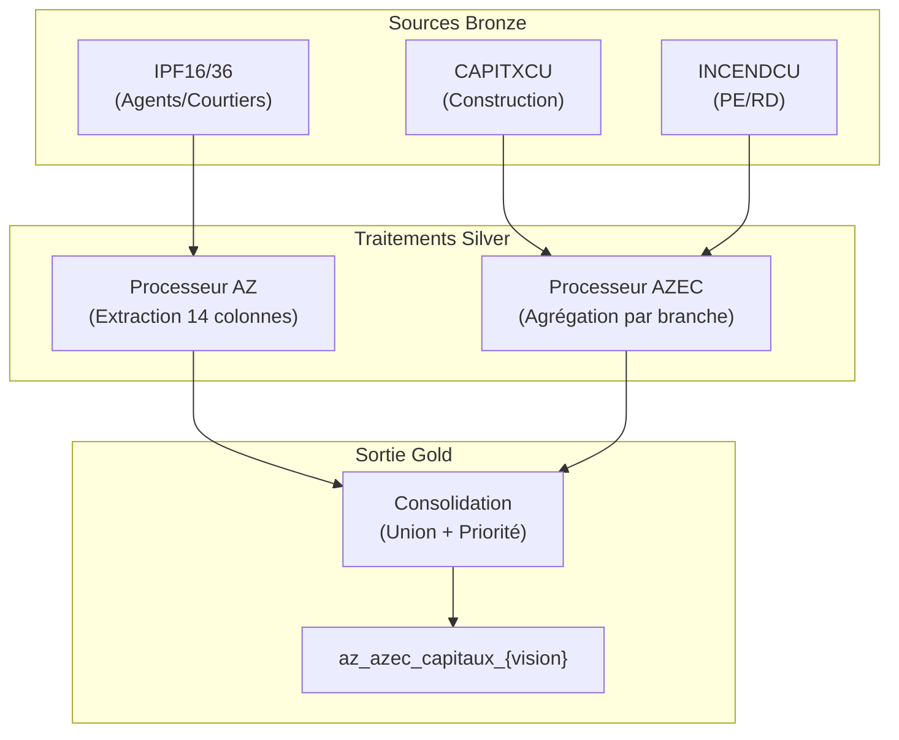

# Workflow Capitaux (AZ + AZEC)

> **Documentation technique du flux de gestion des Capitaux Assurés**
> **Objectif** : Consolider les montants de garanties (SMP, LCI, PE, RD) des deux canaux de distribution.
> **Statut** : En production

---

## 1. Vue d'Ensemble

Le flux Capitaux agrège les données de deux provenances pour fournir une vision unique des engagements de l'assureur.

### Architecture Simplifiée

---

## 2. Pipeline AZ (Canal Agents)

### 2.1 Logique de Traitement

*   **Source** : Fichiers Inventaire Portefeuille (IPF16/36).
*   **Particularité** : Les capitaux sont stockés dans 14 colonnes génériques (`MTCAPI1`...`MTCAPI14`) associées à 14 libellés (`LBCAPI1`...).
*   **Indexation** : Le fichier contient les coefficients d'indexation (`PRPRVC`). Le processeur calcule deux versions :
    *   **Indexé** : Montant * Coefficient.
    *   **Non-Indexé** : Montant brut.

### 2.2 Règles d'Extraction
Le processeur parcourt les 14 occurrences pour trouver les montants via des mots-clés :

| Capital Cible     | Mots-clés (Libellé)                 |
| :---------------- | :---------------------------------- |
| **SMP_100**       | "SMP GLOBAL", "SMP RETENU"          |
| **LCI_100**       | "LCI GLOBAL", "CAPITAL REFERENCE"   |
| **PERTE_EXP**     | "PERTE D EXPLOITATION"              |
| **RISQUE_DIRECT** | "RISQUE DIRECT", "DOMMAGES DIRECTS" |

> **Normalisation** : Tous les montants sont ramenés à 100% en divisant par la part compagnie (`PRCDCIE`).

---

## 3. Pipeline AZEC (Canal Construction)

### 3.1 Logique de Traitement

*   **Sources Composites** :
    *   `CAPITXCU` : Contient les montants de base (SMP, LCI).
    *   `INCENDCU` : Contient les montants complémentaires (Pertes Exploitation, Risques Directs).

### 3.2 Règles de Calcul
Contrairement à AZ (extraction), AZEC fonctionne par **agrégation de branches** :

1.  **SMP_100** = Somme des SMP pour la branche Dommages (`DD`) + branche PE (`PE`).
2.  **PE & RD** = Lus directement dans la table `INCENDCU` et joints par police.
3.  **Indexation** : AZEC ne fournit que des montants indexés.

> **Point d'Attention** : Si le fichier `INCENDCU` est absent, les montants PE/RD sont forcés à 0 (logique de fallback).

---

## 4. Consolidation (Gold)

### 4.1 Stratégie de Fusion
*   **Priorité** : Si une police existe dans les deux systèmes, **AZ écrase AZEC**.
*   **Harmonisation** :
    *   AZEC reçoit le Code Pôle `3` (Courtage) par défaut.
    *   Les colonnes "Non-Indexées" (absentes d'AZEC) sont remplies avec `NULL` pour les lignes AZEC.

### 4.2 Schéma de Sortie (Gold)

| Champ Clé               | Description                                   |
| :---------------------- | :-------------------------------------------- |
| `nopol`                 | Numéro de Police (Clé unique)                 |
| `dircom`                | Origine de la donnée ("AZ" ou "AZEC")         |
| `smp_100_ind`           | Sinistre Maximum Possible (Indexé)            |
| `lci_100_ind`           | Limite Contractuelle d'Indemnisation (Indexé) |
| `value_insured_100_ind` | Valeur Totale Assurée (Calculé : PE + RD)     |

---

**Dernière mise à jour** : 11/02/2026
