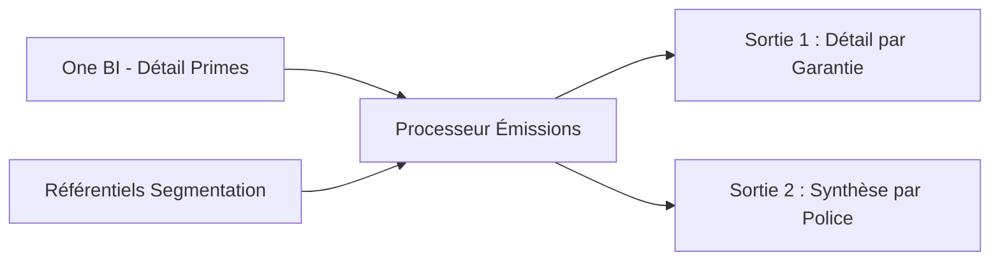

# Workflow Émissions (Primes)

> **Documentation technique du flux de calcul des Primes (Émissions)**
> **Objectif** : Calculer les primes émises et commissions par police et garantie.
> **Statut** : En production

---

## 1. Vue d'Ensemble

Le flux Émissions traite les données détaillées de facturation (Quittancement) pour produire une vision financière du portefeuille.

### Flux de Données

---

## 2. Règles de Transformation

### 2.1 Calculs Temporels (Exercice)
Le processeur distingue les primes selon leur exercice de rattachement :
*   **Exercice Courant (`primes_n`)** : Primes dont l'année comptable correspond à l'année de vision.
*   **Total (`primes_x`)** : Somme de toutes les émissions, quel que soit l'exercice.

### 2.2 Règles Métier
1.  **Code Pôle** : Déduit du canal de distribution (`CD_NIV_2_STC`).
    *   Agents (`DCAG`, `DCPS`) -> Pôle 1.
    *   Courtage (`BROKDIV`) -> Pôle 3.
2.  **Code Garantie** : Extrait du code prospectif (positions 3 à 5).
3.  **Filtre Marché** : Conservation uniquement du marché Construction (`CMARCH=6`).

---

## 3. Sorties (Gold)

Le processeur génère deux niveaux d'agrégation simultanément.

### 3.1 Fichier Détail (POL_GARP)
*   **Nom** : `primes_emises_{vision}_pol_garp`
*   **Granularité** : Une ligne par Police + Code Garantie (`CGARP`).
*   **Usage** : Analyses fines de rentabilité par garantie.

### 3.2 Fichier Synthèse (POL)
*   **Nom** : `primes_emises_{vision}_pol`
*   **Granularité** : Une ligne par Police.
*   **Colonnes Clés** :
    *   `primes_x` : Total primes HT.
    *   `primes_n` : Primes exercice courant HT.
    *   `mtcom_x` : Montant total commissions.

---

**Dernière mise à jour** : 11/02/2026
