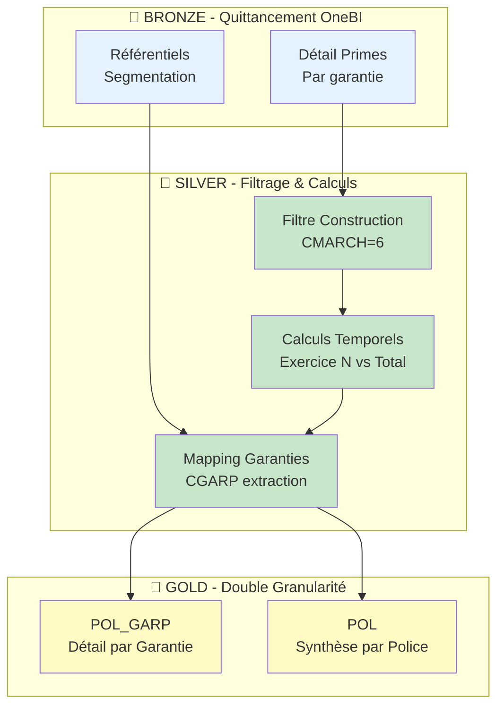
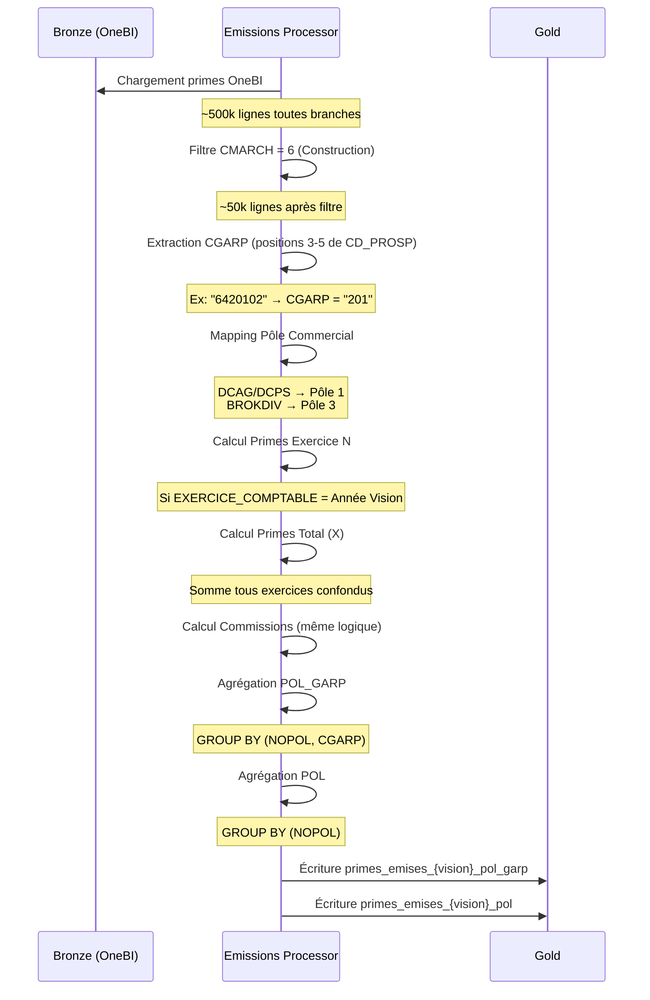

# Workflow Emissions (Calcul des Primes)

> **Documentation technique du flux de calcul des Primes Émises**  
> **Object

if** : Calculer les primes et commissions par police et garantie  
> **Vision** : 202512 (Décembre 2025)

---

## 1. Vue d'Ensemble

### 1.1 But Métier

**Pourquoi calculer les émissions de primes ?**

Les émissions représentent le **chiffre d'affaires brut** de l'assureur. Ce sont les primes facturées aux clients, avant les frais et sinistres. Le suivi précis permet de :
- **Piloter l'activité commerciale** : Volume de ventes par période
- **Analyser la rentabilité** : Primes vs Commissions vs Sinistres
- **Valider la conformité réglementaire** : Déclarations fiscales et prudentielles

### 1.2 Architecture Globale



---

## 2. Source de Données (Bronze)

### 2.1 Fichier d'Entrée : OneBI

**Nom** : `primes_emises_onebi_{vision}.csv`

**Provenance** : Système de facturation OneBI (Quittancement)

**Granularité** : **1 ligne = 1 police + 1 garantie + 1 exercice**

**Volumétrie** : ~500k lignes par mois (toutes branches confondues)

### 2.2 Colonnes Clés

| Colonne              | Description                | Exemple            |
| -------------------- | -------------------------- | ------------------ |
| `NOPOL`              | Numéro de police           | "AB123456"         |
| `CD_PROSP`           | Code prospectif (garantie) | "6420102"          |
| `CMARCH`             | Code marché                | "6" (Construction) |
| `CD_NIV_2_STC`       | Canal de distribution      | "DCAG" (Agents)    |
| `PRINET_HT`          | Prime nette HT             | 5000.00            |
| `MTCOM`              | Montant commission         | 750.00             |
| `EXERCICE_COMPTABLE` | Année de rattachement      | "2025"             |

---

## 3. Pipeline de Transformation

### 3.1 Diagramme de Flux Détaillé



### 3.2 Étapes Détaillées

| Étape | Méthode Python                   | Description                              |
| ----- | -------------------------------- | ---------------------------------------- |
| 1     | `read()`                         | Lecture Bronze + filtre CMARCH=6         |
| 2     | `_extract_guarantee_code()`      | Extraction CGARP (positions 3-5)         |
| 3     | `_map_pole_commercial()`         | Déduction pôle depuis canal distribution |
| 4     | `_calculate_exercise_n_primes()` | Calcul primes exercice courant           |
| 5     | `_calculate_total_primes()`      | Calcul primes tous exercices             |
| 6     | `_aggregate_pol_garp()`          | Agrégation par police + garantie         |
| 7     | `_aggregate_pol()`               | Agrégation par police uniquement         |

---

## 4. Règles de Transformation

### 4.1 Extraction Code Garantie (CGARP)

**Problème** : Le code prospectif est composite (10 caractères) mais on ne veut que la garantie.

**Format CD_PROSP** :
```
Position: 1 2 3 4 5 6 7 8 9 10
Exemple:  6 4 2 0 1 0 2 7 8 9
          │ │ └─┬─┘ └───┬──┘
          │ │   │       │
       Marché│  CGARP  Complément
          │ Branche
        Niveau 1
```

**Extraction** :
```python
CGARP = CD_PROSP[2:5]  # Positions 3, 4, 5
```

**Exemple** :
```
CD_PROSP = "6420102789"
→ CGARP = "201" (Garantie Dommages Ouvrage)
```

### 4.2 Mapping Pôle Commercial

Le pôle (Agent vs Courtier) n'est pas explicite, il faut le déduire du canal.

**Règles** :
| Canal (`CD_NIV_2_STC`) | Signification                      | Pôle |
| ---------------------- | ---------------------------------- | ---- |
| DCAG                   | Direction Commerciale Agents       | 1    |
| DCPS                   | Direction Commerciale Partenariats | 1    |
| BROKDIV                | Broker Division (Courtage)         | 3    |
| Autres                 | Non Construction                   | NULL |

**Code Python** (extrait simplifié) :
```python
when(col("cd_niv_2_stc").isin(["DCAG", "DCPS"]), lit("1"))
.when(col("cd_niv_2_stc") == "BROKDIV", lit("3"))
.otherwise(lit(None))
```

### 4.3 Calculs Temporels

**Pourquoi 2 versions (N et X) ?**

- **Exercice N** : Primes de l'année en cours (pour le P&L annuel)
- **Total X** : Historique complet (pour l'exhaustivité)

**Formules** :
```python
# Primes Exercice N (année courante)
PRIMES_N = SUM(PRINET_HT) WHERE EXERCICE_COMPTABLE = YEAR(Vision)

# Primes Total (tous exercices)
PRIMES_X = SUM(PRINET_HT)  # Sans filtre exercice

# Idem pour commissions
MTCOM_N = SUM(MTCOM) WHERE EXERCICE_COMPTABLE = YEAR(Vision)
MTCOM_X = SUM(MTCOM)
```

**Exemple** :
```
Vision = 202512 (Décembre 2025)

Police ABC a des primes sur 3 exercices :
- Exercice 2023 : 3 000 €
- Exercice 2024 : 4 000 €
- Exercice 2025 : 5 000 €

→ PRIMES_N (2025) = 5 000 €
→ PRIMES_X (Total) = 12 000 €
```

---

## 5. Sorties (Gold)

Le pipeline génère **2 fichiers simultanément** avec des granularités différentes.

### 5.1 Fichier Détail (POL_GARP)

**Nom** : `primes_emises_{vision}_pol_garp.delta`

**Granularité** : **1 ligne = 1 police + 1 garantie (CGARP)**

**Cas d'Usage** :
- Analyse de rentabilité par garantie
- Identification des garanties les plus vendues
- Décomposition du chiffre d'affaires

**Schéma** :
| Colonne    | Type   | Description            | Exemple    |
| ---------- | ------ | ---------------------- | ---------- |
| `nopol`    | STRING | Numéro de police       | "AB123456" |
| `cgarp`    | STRING | Code garantie          | "201"      |
| `cdpole`   | STRING | Pôle commercial        | "1"        |
| `primes_n` | DOUBLE | Primes exercice N HT   | 3500.00    |
| `primes_x` | DOUBLE | Primes total HT        | 10500.00   |
| `mtcom_n`  | DOUBLE | Commissions exercice N | 525.00     |
| `mtcom_x`  | DOUBLE | Commissions total      | 1575.00    |

**Exemple de Données** :
| nopol | cgarp | primes_n | primes_x |
| ----- | ----- | -------- | -------- |
| AB123 | 201   | 3000     | 9000     |
| AB123 | 305   | 500      | 1500     |
| AB123 | 102   | 0        | 0        |

→ Police AB123 a 3 garanties, dont 2 actives

### 5.2 Fichier Synthèse (POL)

**Nom** : `primes_emises_{vision}_pol.delta`

**Granularité** : **1 ligne = 1 police** (toutes garanties agrégées)

**Cas d'Usage** :
- Reporting simplifié pour le métier
- Jointure avec autres tables de portefeuille
- Calculs de KPIs globaux

**Schéma** :
| Colonne        | Type    | Description                         | Exemple    |
| -------------- | ------- | ----------------------------------- | ---------- |
| `nopol`        | STRING  | Numéro de police                    | "AB123456" |
| `cdpole`       | STRING  | Pôle commercial                     | "1"        |
| `primes_n`     | DOUBLE  | **Somme** primes N toutes garanties | 3500.00    |
| `primes_x`     | DOUBLE  | **Somme** primes X toutes garanties | 10500.00   |
| `mtcom_n`      | DOUBLE  | **Somme** commissions N             | 525.00     |
| `mtcom_x`      | DOUBLE  | **Somme** commissions X             | 1575.00    |
| `nb_garanties` | INTEGER | Nombre de garanties actives         | 3          |

**Exemple de Données** :
| nopol | primes_n | primes_x | nb_garanties |
| ----- | -------- | -------- | ------------ |
| AB123 | 3500     | 10500    | 2            |
| CD456 | 8000     | 24000    | 5            |

---

## 6. Points d'Attention Critiques

| Point                 | Criticité | Explication                                             |
| --------------------- | --------- | ------------------------------------------------------- |
| **Filtre CMARCH=6**   | CRITIQUE  | Oublier → inclut tous les marchés (x10 volume)          |
| **Extraction CGARP**  | HAUTE     | Positions 3-5 du code prospectif (ne pas se tromper)    |
| **Exercice vs Total** | MOYENNE   | Bien distinguer PRIMES_N (année) vs PRIMES_X (cumul)    |
| **Double Sortie**     | MOYENNE   | POL_GARP ET POL doivent être cohérents (sommes)         |
| **NULL vs 0**         | BASSE     | Commission NULL = info manquante, 0 = pas de commission |

---

## 7. Exemple Complet : Police de A à Z

### Données Brutes (Bronze)

**Fichier OneBI** pour Police "ABC123" :
```csv
NOPOL,CD_PROSP,CMARCH,CD_NIV_2_STC,PRINET_HT,MTCOM,EXERCICE_COMPTABLE
ABC123,6420102,6,DCAG,3000,450,2024
ABC123,6420102,6,DCAG,5000,750,2025
ABC123,6430503,6,DCAG,1000,150,2025
```

### Traitement (Silver)

**Étape 1 : Extraction CGARP**
```
Ligne 1 : CD_PROSP = "6420102" → CGARP = "201"
Ligne 2 : CD_PROSP = "6420102" → CGARP = "201"
Ligne 3 : CD_PROSP = "6430503" → CGARP = "305"
```

**Étape 2 : Mapping Pôle**
```
CD_NIV_2_STC = "DCAG" → CDPOLE = "1"
```

**Étape 3 : Calculs Temporels** (Vision = 202512, Année = 2025)
```
Garantie 201 :
  PRIMES_N (2025) = 5000
  PRIMES_X (Total) = 3000 + 5000 = 8000
  
Garantie 305 :
  PRIMES_N (2025) = 1000
  PRIMES_X (Total) = 1000
```

### Résultat (Gold)

**Fichier POL_GARP** :
| nopol  | cgarp | cdpole | primes_n | primes_x | mtcom_n | mtcom_x |
| ------ | ----- | ------ | -------- | -------- | ------- | ------- |
| ABC123 | 201   | 1      | 5000     | 8000     | 750     | 1200    |
| ABC123 | 305   | 1      | 1000     | 1000     | 150     | 150     |

**Fichier POL** :
| nopol  | cdpole | primes_n | primes_x | mtcom_n | mtcom_x | nb_garanties |
| ------ | ------ | -------- | -------- | ------- | ------- | ------------ |
| ABC123 | 1      | 6000     | 9000     | 900     | 1350    | 2            |

---

## 8. Validation & Contrôles Qualité

### 8.1 Contrôles Automatiques

Le processeur effectue ces vérifications :

1. **Volume** : Nombre de lignes Construction cohérent (~50k attendu)
2. **Cohérence POL vs POL_GARP** :
   ```sql
   SUM(POL.primes_x) = SUM(POL_GARP.primes_x) GROUP BY nopol
   ```
3. **Montants positifs** : Pas de primes négatives (sauf avoirs explicites)

### 8.2 Contrôles Manuels Recommandés

```python
# Vérifier top 10 polices par volume
df_pol.orderBy(desc("primes_x")).limit(10).show()

# Vérifier distribution par pôle
df_pol.groupBy("cdpole").agg(sum("primes_x")).show()

# Identifier polices sans garantie
df_pol.filter(col("nb_garanties") == 0).count()
```

---

## 9. Commandes d'Exécution

```bash
# Exécuter le pipeline Emissions pour vision 202512
python main.py --component emissions --vision 202512

# Vérifier les logs
tail -f logs/emissions_202512.log

# Requête exemple POL (PySpark)
df_pol = spark.read.format("delta").load("/path/to/gold/primes_emises_202512_pol")
df_pol.select("nopol", "primes_n", "primes_x").show()

# Requête exemple POL_GARP (détail garanties)
df_garp = spark.read.format("delta").load("/path/to/gold/primes_emises_202512_pol_garp")
df_garp.filter(col("cgarp") == "201").show()
```

---

## 10. Différences avec old_version

| Aspect                     | old_version   | new_python    | Impact       |
| -------------------------- | ------------- | ------------- | ------------ |
| Source OneBI               | ✓             | ✓             | Identique    |
| Filtre CMARCH=6            | ✓             | ✓             | Identique    |
| Extraction CGARP           | Positions 3-5 | Positions 3-5 | Identique    |
| Double sortie POL/POL_GARP | ✓             | ✓             | Identique    |
| Format sortie              | Parquet       | Delta         | Amélioration |

**Conclusion** : Logique métier 100% préservée, format de stockage amélioré (Delta = versioning + ACID).

---

**Dernière Mise à Jour** : 11/02/2026  
**Fichier Python** : `src/processors/emissions_processors/emissions_processor.py`  
**Configurations** : `config/transformations/emissions_config.json`
