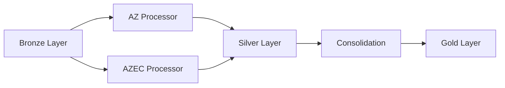

# PTF_MVT Workflow

## Purpose

Processes construction insurance portfolio data to calculate:
- Movement indicators (AFN, RES, RPT, RPC, PTF)
- Exposure metrics (YTD and monthly)
- Capital amounts (SMP, LCI, PE, RD)

---

## Pipeline Overview

**Stages:**
1. **AZ Processor** → Agent + Courtage channel policies
2. **AZEC Processor** → AZEC construction policies  
3. **Consolidation** → Merge + IRD risk enrichment

---

## Input Sources

| Source | File Pattern | Layer | Description |
|--------|-------------|-------|-------------|
| IPF Agent | `*IPFE16_IPF_*.csv.gz` | Bronze/monthly | Agent policies |
| IPF Courtage | `*IPFE36_IPF_*.csv.gz` | Bronze/monthly | Courtage policies |
| IPFM99 | `*SPEIPFM99_IPF_*.csv.gz` | Bronze/monthly | Product 01099 data |
| POLIC_CU | `polic_cu.csv` | Bronze/ref | AZEC policies |
| CAPITXCU | `capitxcu.csv` | Bronze/ref | AZEC capitals |
| INCENDCU | `incendcu.csv` | Bronze/ref | NAF codes + PE/RD |
| IRD Risk | `ird_risk_q45/q46*.csv` | Bronze/monthly | Risk classification |

---

## Business Filters

| Filter | Value | Description |
|--------|-------|-------------|
| CMARCH | 6 | Construction market |
| CSEGT | 2 | Construction segment |
| CDSITP | ≠ 4, 5 | Valid policy status |
| CDNATP | R, O, T, C | Valid nature types |
| NOINT | Exclusion list | Business exclusions |

---

## Key Calculations

### Movement Indicators

| Indicator | Description | Condition |
|-----------|-------------|-----------|
| **NBAFN** | New policies | Policy created in period |
| **NBRES** | Terminations | Policy terminated in period |
| **NBRPT** | Replacement (new) | Replaced another policy |
| **NBRPC** | Replacement (old) | Was replaced |
| **NBPTF** | Active portfolio | No movement, still active |

> Each policy has exactly ONE indicator = 1

### Exposure Metrics

| Metric | Description |
|--------|-------------|
| **EXPO_YTD** | Year-to-date exposure (days/365) |
| **EXPO_GLI** | Monthly exposure (days/month days) |

### Capital Extraction

| Capital | Keywords Searched |
|---------|-------------------|
| **SMP_100** | "SMP GLOBAL", "SMP RETENU" |
| **LCI_100** | "LCI GLOBAL", "CAPITAL REFERENCE" |
| **PERTE_EXP** | "PERTE D EXPLOITATION" |
| **RISQUE_DIRECT** | "RISQUE DIRECT", "DOMMAGES DIRECTS" |

---

## Output Datasets

### Silver Layer (Intermediate)

| # | Dataset | Rows | Description |
|---|---------|------|-------------|
| 1 | `mvt_const_ptf_{vision}` | ~68K | AZ channel movements |
| 2 | `azec_ptf_{vision}` | ~12K | AZEC channel movements |

### Gold Layer (Final)

| # | Dataset | Rows | Description |
|---|---------|------|-------------|
| 3 | `mvt_ptf_{vision}` | ~80K | Consolidated movements |
| 4 | `ird_risk_q45_{vision}` | Ref | Risk classification Q45 |
| 5 | `ird_risk_q46_{vision}` | Ref | Risk classification Q46 |

---

## Output Schema (mvt_ptf)

### Identifiers
- `nopol` - Policy number
- `noclt` - Client number
- `cdprod` - Product code

### Dates
- `dtcrepol` - Creation date
- `dteffan` - Effective date
- `dtresilp` - Termination date
- `vision` - Processing vision (YYYYMM)

### Movements
- `nbafn`, `nbres`, `nbrpt`, `nbrpc`, `nbptf`
- `primes_afn`, `primes_res`, `primes_ptf`

### Capitals
- `smp_100`, `lci_100`
- `perte_exp`, `risque_direct`

### Exposure
- `expo_ytd`, `expo_gli`

### Coassurance
- `coass` - Type (APERITION, COASS ACCEPTEE, etc.)
- `partcie` - Company share
- `top_coass` - Leader flag

### Segmentation
- `dircom` - Commercial direction (100=AZ, 400=AZEC)
- `segment2`, `type_produit_2`, `upper_mid`
