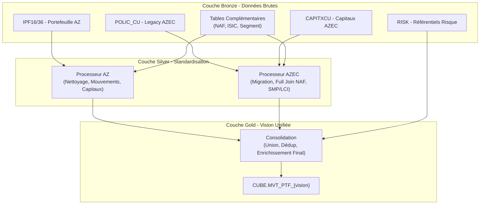
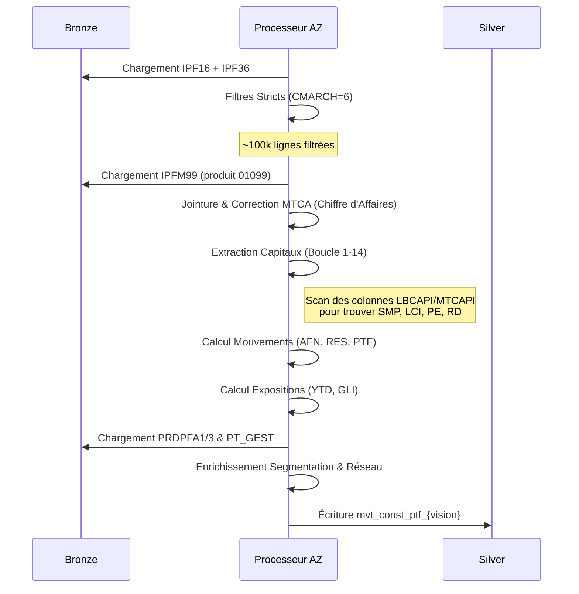
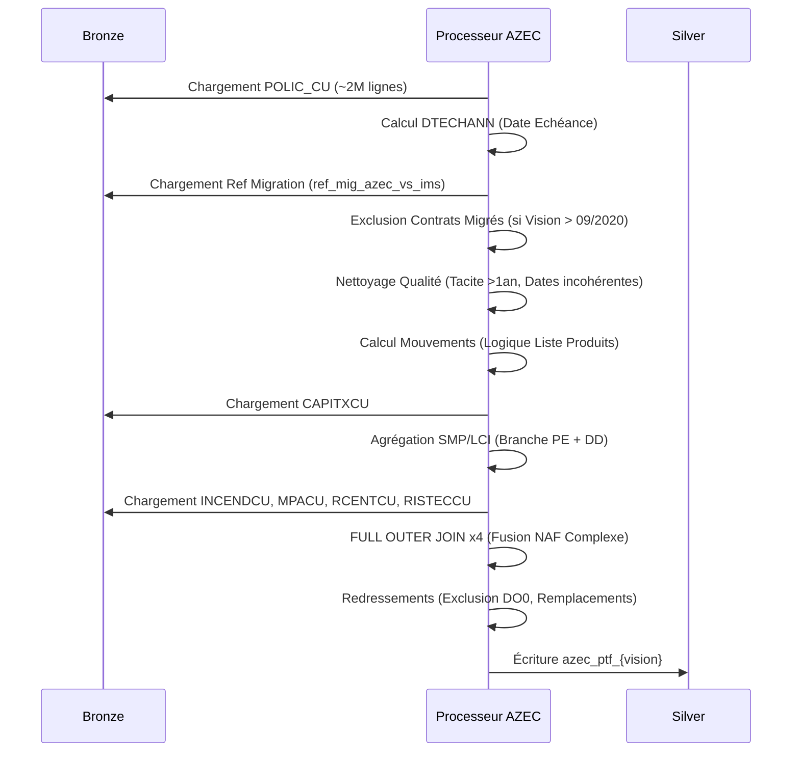
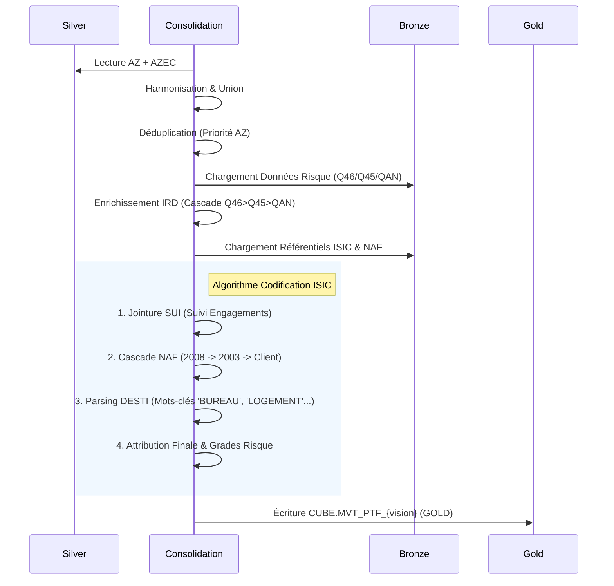

# Flux de Données - Pipelines PTF_MVT

> **Documentation technique officielle des flux de données Portefeuille et Mouvements (PTF_MVT)**
> **Périmètre** : Construction (AZ + AZEC)
> **Statut** : En production (Décembre 2025)

---

## 1. Vue d'Ensemble & Architecture

Le pipeline `PTF_MVT` a pour but de consolider les données de portefeuille construction provenant de deux sources historiques distinctes (Agents et Legacy Construction) pour fournir une vision unifiée (Gold) des mouvements, des expositions et des capitaux.

### Architecture 3-Tiers

---

## 2. Pipeline AZ (Agents & Courtiers)

Ce flux traite les données issues des canaux traditionnels (Agents et Courtiers) en filtrant spécifiquement l'activité Construction.

### 2.1 Synthèse

| Attribut           | Valeur                                                                  |
| ------------------ | ----------------------------------------------------------------------- |
| **Entrée Bronze**  | `IPF16` (Agent), `IPF36` (Courtage), `IPFM99` (Produits Spéciaux)       |
| **Filtres Métier** | `CMARCH='6'` (Marché Construction) ET `CSEG='2'` (Segment Construction) |
| **Sortie Silver**  | `mvt_const_ptf_{vision}`                                                |

### 2.2 Diagramme de Traitement

### 2.3 Règles Métier Clés (AZ)

#### Extraction des Capitaux (Moteur de Recherche)
Le fichier source contient 14 paires de colonnes génériques (`LBCAPI1`/`MTCAPI1` à `LBCAPI14`/`MTCAPI14`). Le processeur scanne ces colonnes pour identifier les montants clés via des mots-clés :
*   **SMP_100** : Recherche "SMP GLOBAL", "SMP RETENU".
*   **LCI_100** : Recherche "LCI GLOBAL", "CAPITAL REFERENCE".
*   **PERTE_EXP** : Recherche "PERTE D EXPLOITATION".
*   **RISQUE_DIRECT** : Recherche "RISQUE DIRECT", "DOMMAGES DIRECTS".
> *Règle : "La dernière écriture l'emporte" (si un mot-clé apparaît deux fois, la valeur la plus à droite (ex: index 14) est retenue).*

#### Indicateurs de Mouvement AZ ([business_logic.py](cci:7://file:///home/amiche/Projects/LocalIngest/code/new_python/utils/transformations/operations/business_logic.py:0:0-0:0))
*   **NBAFN** (Affaire Nouvelle) : Date d'effet (`DTEFFAN`) dans l'année vision OU Date de création (`DTCREPOL`) dans l'année.
*   **NBRES** (Résiliation) : Date de résiliation (`DTRESILP`) dans l'année vision.
*   **NBPTF** (Portefeuille) : Contrat actif en fin de période (`DTRESILP > Fin Année` ou NULL).

---

## 3. Pipeline AZEC (Construction Spécifique)

Ce flux traite les données du système de gestion historique dédié à la Construction (Legacy). Il est particulièrement complexe en raison de la migration progressive vers le nouveau système (IMS).

### 3.1 Synthèse

| Attribut             | Valeur                                                   |
| -------------------- | -------------------------------------------------------- |
| **Entrée Bronze**    | `POLIC_CU`, `CAPITXCU`, `INCENDCU`, `MPACU`...           |
| **Filtre Migration** | Vision > 202009 : Exclusion des contrats migrés vers IMS |
| **Sortie Silver**    | `azec_ptf_{vision}`                                      |

### 3.2 Diagramme de Traitement

### 3.3 Règles Métier Clés (AZEC)

#### Gestion de la Migration
Pour éviter les doublons avec le nouveau système (IMS), une table de référence (`ref_mig_azec_vs_ims`) est utilisée à partir de la vision **Septembre 2020**.
*   Si un contrat est présent dans cette table, il est considéré comme **migré** et donc exclu des comptes AZEC (indicateur `NBPTF_NON_MIGRES_AZEC = 0`).

#### Fusion NAF (Full Join 4 Tables)
L'information du code NAF peut se trouver dans 4 tables satellites différentes. Pour ne perdre aucune donnée, le processeur effectue un **FULL OUTER JOIN** en cascade sur `INCENDCU`, `MPACU`, `RCENTCU` et `RISTECCU`.
> *Règle : Le code NAF retenu est le premier non-nul trouvé dans l'ordre de fusion.*

#### Agrégation SMP/LCI
Contrairement à AZ (extraction), AZEC demande une **agrégation** des capitaux.
*   **SMP_100** = Somme des SMP pour la branche "Dommages" (`DD`) + branche "Pertes Exploitation" (`PE`).

---

## 4. Pipeline Consolidation (Silver -> Gold)

C'est l'étape finale qui fusionne les deux visions et applique les enrichissements transverses (notamment la codification ISIC).

### 4.1 Logique de Fusion & Priorité
Les deux flux (AZ et AZEC) sont unis (`UNION BY NAME`).
**Règle de Dédoublonnage** : Si un numéro de police (`NOPOL`) existe dans les deux flux, **la version AZ est prioritaire** et écrase la version AZEC.

### 4.2 Diagramme de Consolidation

### 4.3 Algorithme de Codification ISIC ([isic_codification.py](cci:7://file:///home/amiche/Projects/LocalIngest/code/new_python/utils/transformations/base/isic_codification.py:0:0-0:0))

L'attribution du code activité ISIC suit une cascade de règles stricte pour garantir un taux de remplissage maximal :

1.  **Correspondance SUI** : Si le contrat est connu dans le "Suivi des Engagements", on prend le code ISIC déclaré.
2.  **Activité (NAT='R')** : Si c'est un contrat d'activité, on utilise une table de mapping spécifique.
3.  **Chantier (NAT='C') - Destination** :
    *   Si produit 01059 -> ISIC 'VENTE'.
    *   Sinon, on analyse le libellé de destination (`DSTCSC`) avec des regex (ex: "HABIT" -> "RESIDENTIEL", "BUREAU" -> "BUREAU").
4.  **Chantier (NAT='C') - Mapping** : On utilise le mapping ISIC Chantier.
5.  **Repli NAF** : Si toujours rien, on convertit le code NAF (NAF 2008 ou 2003) via une table de correspondance.

Enfin, une fois le code ISIC attribué, on joint la table des **Hazard Grades** (Fire, Bi, Rca...) correspondants.

---

## 5. Dictionnaire des Règles de Gestion (Langage Naturel)

Voici la traduction en langage courant des formules techniques utilisées dans le code.

| Indicateur                        | Définition Métier / Règle de Gestion                                                                                                                    |
| :-------------------------------- | :------------------------------------------------------------------------------------------------------------------------------------------------------ |
| **NBAFN** (Affaires Nouvelles)    | Comptabilise un contrat comme "Nouveau" si sa date d'effet démarre dans l'année fiscale en cours, ou s'il a été saisi (créé) dans l'année.              |
| **NBRES** (Résiliations)          | Comptabilise un contrat comme "Résilié" si sa date de fin effective tombe dans l'année fiscale en cours.                                                |
| **NBPTF** (Portefeuille)          | Comptabilise un contrat comme "En Portefeuille" s'il est actif au dernier jour du mois de vision (ni résilié avant, ni sans effet).                     |
| **Exposition YTD** (Year-To-Date) | Pourcentage de l'année couvert par le contrat.  *(Date Fin effective - Date Début Année) / 365*.  Si un contrat couvre toute l'année, Expo = 1.0. |
| **Cotisation 100%**               | Montant de la prime ramené à 100% pour les contrats en coassurance.  *Formule : (Prime Nette * 100) / Part Compagnie*.                               |
| **Part Compagnie**                | Pourcentage du risque porté par notre compagnie. Vaut 100% (1.0) s'il n'y a pas de coassurance.                                                         |

---

**Contact Technique** : Équipe Data Engineering
**Dernière mise à jour** : 11/02/2026