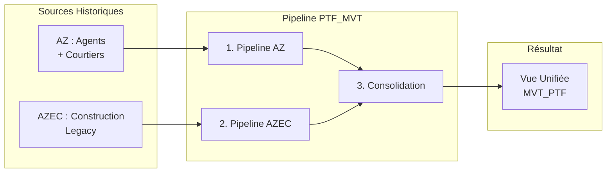
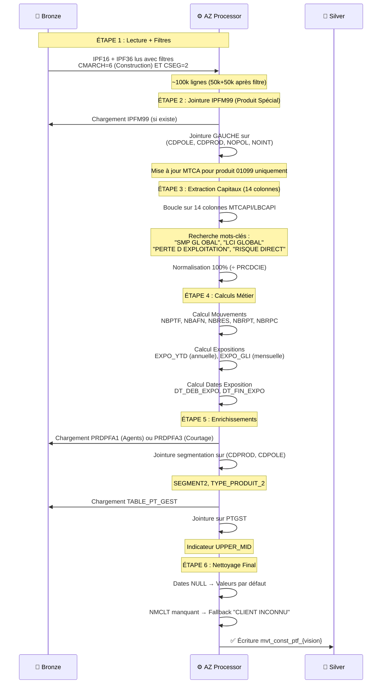
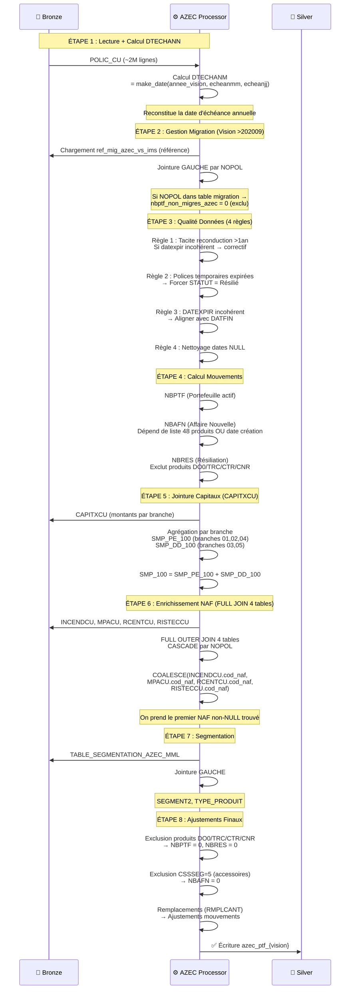
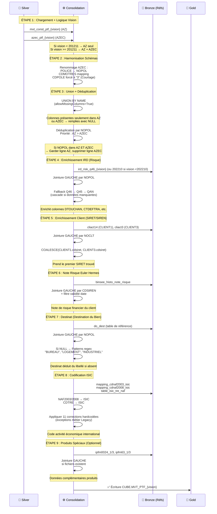
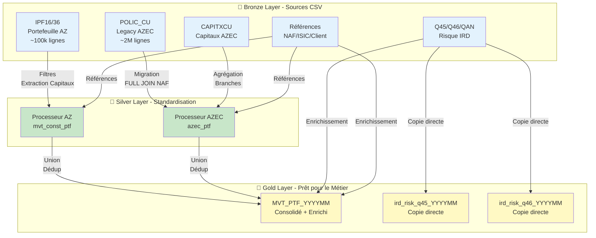

# Flux de Données - Pipelines PTF_MVT

> **Documentation technique des flux de données pour les 3 pipelines PTF_MVT**  
> **Vision** : 202512 (Décembre 2025)  
> **Public** : Équipes métier, analystes, développeurs

---

## Vue d'Ensemble : Qu'est-ce que PTF_MVT ?

**PTF_MVT** signifie "**Portefeuille Mouvements**". Ce sont les 3 pipelines qui suivent l'évolution du portefeuille d'assurance construction :
- **Nouvelles polices** (Affaires Nouvelles - AFN)
- **Résiliations** (RES)
- **Renouvellements** (Portefeuille actif - PTF)

### Pourquoi 3 Pipelines ?

L'assurance construction a historiquement 2 canaux distincts :
1. **AZ** (Agents + Courtiers) : Canaux traditionnels gérés par le système IMS
2. **AZEC** (Construction Spécialisée) : Système historique dédié à la construction

Ces 2 flux sont **consolidés** en Gold pour avoir une seule vue unifiée.



---

## 1. Pipeline AZ (Agent + Courtage)

### 1.1 But Métier

**Que fait ce pipeline ?**

Il transforme les données brutes du portefeuille traditionnel (Agents et Courtiers) pour :
- Identifier les nouveaux contrats signés ce mois
- Repérer les résiliations
- Calculer les montants assurés (capitaux)
- Calculer les expositions (combien de temps le contrat était actif)

**Pourquoi deux fichiers (IPF16 et IPF36) ?**
- **IPF16** : Réseau Agents (Pôle 1)
- **IPF36** : Réseau Courtage (Pôle 3)

Ces deux réseaux ont des structures commerciales différentes (commissions, segmentation), donc on les distingue dès la source.

### 1.2 Vue d'Ensemble

| Attribut          | Valeur                                                                                                                |
| ----------------- | --------------------------------------------------------------------------------------------------------------------- |
| **Entrée Bronze** | IPF16 (Agent) (~50k lignes), IPF36 (Courtage) (~50k lignes), IPFM99 (produit spécial 01099), PRDPFA1/3 (segmentation) |
| **Sortie Silver** | `mvt_const_ptf_{vision}` (ex: mvt_const_ptf_202512)                                                                   |
| **Volume**        | ~100k lignes après filtres Construction                                                                               |
| **Temps exec**    | 3-5 min (selon cluster)                                                                                               |

### 1.3 Diagramme de Flux



### 1.4 Étapes Détaillées avec Explications

| Étape | Code Python                          | Que fait-elle ?                                                                                                                          | Pourquoi c'est important ?                                                        |
| ----- | ------------------------------------ | ---------------------------------------------------------------------------------------------------------------------------------------- | --------------------------------------------------------------------------------- |
| 1     | `read()`                             | Lit IPF16 + IPF36 ET applique immédiatement les filtres CMARCH=6 (Construction) et CSEG=2 (Segment Construction) **AVANT l'union**       | Réduit le volume dès la lecture (10x moins de données) → gain de performance      |
| 2     | `_join_ipfm99()`                     | Pour le produit 01099 uniquement, va chercher le chiffre d'affaires (MTCA) dans IPFM99 au lieu du fichier principal                      | Ce produit a une structure spéciale (données réparties sur plusieurs fichiers)    |
| 3     | `extract_capitals()` (transform)     | Parcourt les 14 colonnes MTCAPI/LBCAPI pour trouver les capitaux par mots-clés ("SMP GLOBAL", "LCI GLOBAL", etc.), puis normalise à 100% | Les capitaux ne sont pas dans des colonnes fixes mais dans 14 colonnes génériques |
| 4     | `calculate_az_movements()`           | Calcule si le contrat est AFN (nouveau), RES (résilié), PTF (renouvelé) selon dates d'effet et de résiliation                            | Core business : identifier l'évolution du portefeuille                            |
| 5     | `calculate_expositions()`            | Calcule combien de jours le contrat était actif dans l'année (EXPO_YTD) et dans le mois (EXPO_GLI)                                       | Essentiel pour les calculs de primes proratisées                                  |
| 6     | `_enrich_segment_and_product_type()` | Ajoute SEGMENT2 (PME, Corporate...) et TYPE_PRODUIT_2 depuis PRDPFA1 (Agents) ou PRDPFA3 (Courtage), puis UPPER_MID depuis TABLE_PT_GEST | Segmentation commerciale pour analyses stratégiques                               |
| 7     | Nettoyage final                      | Remplace les dates NULL par des valeurs cohérentes, remplace les noms clients manquants par "CLIENT INCONNU"                             | Évite les erreurs en aval, garantit qualité des données                           |

### 1.5 Points Critiques AZ

> [!WARNING]
> **Filtres Construction (CMARCH=6 ET CSEG=2)**
> 
> Ces filtres sont appliqués **dès la lecture** pour ne charger que les données Construction. Oublier ces filtres chargerait TOUT le portefeuille (tous marchés confondus), soit 10x plus de données !

> [!IMPORTANT]
> **Extraction 14 Colonnes MTCAPI/LBCAPI**
> 
> Les capitaux ne sont PAS dans des colonnes fixes. Le code parcourt 14 colonnes génériques et cherche des mots-clés comme "SMP GLOBAL". Si un nouveau libellé apparaît (exemple : la FFB change les termes), il faut l'ajouter dans `config/transformations/az_transformations.json`.

> [!CAUTION]
> **Normalisation 100% (÷ PRCDCIE)**
> 
> Formule : `Capital_100 = Capital_Brut × (100 / PRCDCIE)`
> 
> En coassurance, le capital affiché est seulement la part de notre compagnie (ex: 60%). La normalisation ramène à 100% pour avoir le capital total assuré. **Oublier cette étape diviserait les capitaux par 2-3** (erreur très grave).

---

## 2. Pipeline AZEC (Construction Legacy)

### 2.1 But Métier

**Que fait ce pipeline ?**

AZEC traite les données du système historique dédié à la Construction (avant la migration vers IMS). Les polices AZEC :
- Ont une structure différente de AZ
- Utilisent des tables satellites (CAPITXCU, INCENDCU, MPACU...)
- Migrent progressivement vers IMS (depuis Septembre 2020)

**Particularité** : Vision >202009 → certaines polices ont **migré vers IMS** (donc déjà dans AZ). Il faut les exclure d'AZEC pour éviter les doublons.

### 2.2 Vue d'Ensemble

| Attribut          | Valeur                                                                                                                  |
| ----------------- | ----------------------------------------------------------------------------------------------------------------------- |
| **Entrée Bronze** | POLIC_CU (~2M lignes avant filtre migration), CAPITXCU, INCENDCU, MPACU, RCENTCU, RISTECCU, TABLE_SEGMENTATION_AZEC_MML |
| **Sortie Silver** | `azec_ptf_{vision}` (ex: azec_ptf_202512)                                                                               |
| **Volume**        | Varie selon vision (diminue au fil des migrations vers IMS)                                                             |
| **Temps exec**    | 8-12 min (jointures multiples + agrégations)                                                                            |

### 2.3 Diagramme de Flux



### 2.4 Étapes Spécifiques AZEC

| Étape | Code Python                  | Que fait-elle ?                                                                                                          | Pourquoi c'est critique ?                                                                                         |
| ----- | ---------------------------- | ------------------------------------------------------------------------------------------------------------------------ | ----------------------------------------------------------------------------------------------------------------- |
| 1     | `read()`                     | Lit POLIC_CU ET calcule DTECHANM en reconstituant une date depuis les champs `echeanmm` (mois) et `echeanjj` (jour)      | POLIC_CU ne stocke pas la date d'échéance complète, juste mois et jour. Il faut la reconstruire pour les calculs. |
| 2     | `_handle_migration()`        | Si vision >202009, charge `ref_mig_azec_vs_ims` et marque les polices migrées `nbptf_non_migres_azec=0` pour les exclure | **CRITIQUE** : Évite de compter 2x les mêmes polices (une fois dans AZEC, une fois dans AZ après migration)       |
| 3     | `_update_dates_and_states()` | Applique 4 règles de nettoyage : tacite reconduction >1an, temporaires expirées, DATEXPIR incohérent, dates NULL         | Qualité donnée faible dans AZEC Legacy → nettoyage essentiel                                                      |
| 4     | `_calculate_movements()`     | Calcule NBAFN/NBRES/NBPTF avec logique spécifique : liste de 48 produits pour AFN, exclusions DO0/TRC/CTR/CNR pour RES   | Logique métier AZEC différente de AZ (liste produits vs dates)                                                    |
| 5     | `_join_capitals()`           | Charge CAPITXCU, agrège par branche (PE=01,02,04 et DD=03,05), calcule SMP_100 = SMP_PE_100 + SMP_DD_100                 | Contrairement à AZ (extraction), AZEC fait de l'agrégation de branches                                            |
| 6     | `_enrich_naf_codes()`        | **FULL OUTER JOIN** de 4 tables (INCENDCU, MPACU, RCENTCU, RISTECCU) puis COALESCE pour prendre le premier NAF non-NULL  | **CRITIQUE** : Le NAF peut être dans n'importe laquelle des 4 tables. FULL JOIN = ne perdre aucune police         |
| 7     | `_adjust_nbres()`            | Exclut DO0/TRC/CTR/CNR (NBPTF=0, NBRES=0), exclut CSSSEG=5 pour AFN, gère remplacements RMPLCANT                         | Redressements métier finaux spécifiques AZEC                                                                      |

### 2.5 Points Critiques AZEC

> [!CAUTION]
> **Filtre Migration (Vision >202009)**
> 
> Pour les visions récentes, **OBLIGATOIRE** de charger `ref_mig_azec_vs_ims` et d'exclure les polices migrées. Sinon, ces polices apparaîtront dans AZ ET AZEC → **doublons graves** qui fausseront tous les indicateurs (comptages x2).

> [!IMPORTANT]
> **FULL OUTER JOIN 4 Tables NAF**
> 
> ```python
> FULL OUTER JOIN INCENDCU, MPACU, RCENTCU, RISTECCU
> COALESCE(INCENDCU.cod_naf, MPACU.cod_naf, RCENTCU.cod_naf, RISTECCU.cod_naf)
> ```
> 
> Le code NAF peut être dans n'importe laquelle des 4 tables satellites. Un LEFT JOIN classique perdrait des polices. Le FULL OUTER JOIN garantit qu'on garde **toutes** les polices, même si elles ne sont que dans une seule table.

> [!WARNING]
> **Liste 48 Produits pour NBAFN**
> 
> Pour AZEC, une affaire nouvelle dépend de la **liste de 48 produits spécifiques** codée en dur dans `config/transformations/azec_transformations.json`. Si un nouveau produit apparaît et qu'il devrait compter comme AFN, il faut l'ajouter à cette liste.

---

## 3. Pipeline CONSOLIDATION (AZ + AZEC → Gold)

### 3.1 But Métier

**Que fait ce pipeline ?**

La Consolidation fusionne les deux flux (AZ + AZEC) pour créer une **vue unique** du portefeuille construction. Elle :
- Harmonise les schémas (colonnes différentes entre AZ et AZEC)
- Élimine les doublons (priorité AZ)
- **Enrichit** avec des données externes (Risque IRD, Client, ISIC...)

**Pourquoi enrichir ici et pas avant ?**

Enrichir en Gold évite de dupliquer le travail. On enrichit une seule fois le dataset consolidé au lieu de 2 fois (AZ + AZEC séparément).

### 3.2 Vue d'Ensemble

| Attribut          | Valeur                                   |
| ----------------- | ---------------------------------------- |
| **Entrée Silver** | mvt_const_ptf (AZ), azec_ptf (AZEC)      |
| **Sortie Gold**   | `CUBE.MVT_PTF_{vision}`                  |
| **Volume**        | AZ + AZEC consolidé (varie selon vision) |
| **Temps exec**    | 10-15 min (enrichissements multiples)    |

### 3.3 Diagramme de Flux



### 3.4 Logique Dépendante de la Vision

**Pourquoi la vision change le comportement ?**

Le système d'assurance a évolué au fil du temps :
- **Avant Novembre 2012** (vision <201211) : Seulement AZ existait
- **Depuis Novembre 2012** : AZ + AZEC existent tous les deux
- **Avant Octobre 2022** (vision <202210) : Données Risque fixes (réf 202210)
- **Depuis Octobre 2022** : Données Risque mensuelles

| Seuil Vision  | Logique                                               | Explication                                                    |
| ------------- | ----------------------------------------------------- | -------------------------------------------------------------- |
| **<  201211** | AZ seul (pas d'AZEC)                                  | AZEC n'existait pas encore dans le système                     |
| **>= 201211** | Union AZ + AZEC                                       | Les deux systèmes coexistent, on les consolide                 |
| **< 202210**  | Utiliser RISK_REF 202210 (version figée)              | Avant cette date, pas de données Risque mensuelles disponibles |
| **>= 202210** | Utiliser RISK vision courante (ird_risk_{vision}.csv) | Données fraîches chaque mois                                   |

### 3.5 Enrichissements Gold Détaillés

| #   | Enrichissement             | Source Bronze                                                     | Clé Jointure            | Logique Fallback                 | Utilité métier                                                           |
| --- | -------------------------- | ----------------------------------------------------------------- | ----------------------- | -------------------------------- | ------------------------------------------------------------------------ |
| 1   | **Données Risque IRD**     | ird_risk_q46/q45/qan_{vision}                                     | NOPOL                   | Q46 → Q45 → QAN (cascade)        | Typologie du risque (DTOUCHAN, CTDEFTRA...) pour tarification            |
| 2   | **Client SIRET/SIREN**     | cliact14 (CLIENT1 - Pôle 1), cliact3 (CLIENT3 - Pôle 3)           | NOCLT (n° client)       | COALESCE(CLIENT1, CLIENT3)       | Identification entreprise pour analyses croisées                         |
| 3   | **Note Risque Euler**      | binsee_histo_note_risque                                          | CDSIREN + validité date | NULL si non trouvé               | Évaluation risque financier du client (risque de défaut)                 |
| 4   | **Destinat**               | do_dest (table référence)                                         | NOPOL                   | Patterns regex si NULL           | Destination du bien assuré (Bureau, Logement, Industriel...)             |
| 5   | **Codification ISIC**      | mapping_cdnaf2003/2008_isic, table_isic_tre_naf, isic_lg          | CDNAF + CDTRE           | NAF2003/2008 + 11 fix hardcodés  | Code activité économique international (pour benchmarks, risque secteur) |
| 6   | **Produits Spéciaux IPFM** | ipfm0024_1/3 (garanties complémentaires), ipfm63_1/3 (exclusions) | NOPOL + CDPROD          | Optionnel (si fichiers existent) | Détails garanties/exclusions pour certains produits                      |

### 3.6 Points Critiques CONSOLIDATION

> [!CAUTION]
> **UNION BY NAME avec allowMissingColumns=True**
> 
> ```python
> df_az.unionByName(df_azec, allowMissingColumns=True)
> ```
> 
> AZ et AZEC n'ont PAS exactement les mêmes colonnes. `allowMissingColumns=True` ajoute des NULL pour les colonnes manquantes. **Ne JAMAIS utiliser `union()` classique** qui supposerait même ordre de colonnes (erreur grave).

> [!IMPORTANT]
> **Déduplication par NOPOL : Priorité AZ**
> 
> Si un NOPOL existe dans AZ ET AZEC, on garde **toujours AZ**. Pourquoi ? AZ est le système le plus récent et mis à jour (IMS), donc source de vérité. AZEC est Legacy.
> 
> ```python
> # Pseudo-code
> df_union.dropDuplicates(['nopol'], keep='first')  # Premier = AZ car ajouté avant AZEC
> ```

> [!WARNING]
> **11 Corrections ISIC Hardcodées**
> 
> Il existe 11 exceptions métier codées en dur dans le code (héritées du système SAS Legacy). Ces corrections forcent certains codes ISIC pour des cas particuliers connus. **Ne PAS supprimer** ces lignes sans validation métier, elles corrigent des anomalies historiques.

---

## 4. Architecture Globale - Vue 3-Tiers



---

## 5. Points d'Attention par Pipeline

### 5.1 Pipeline AZ

| Point                    | Criticité | Description                                                                            | Impact si oublié                            |
| ------------------------ | --------- | -------------------------------------------------------------------------------------- | ------------------------------------------- |
| **Filtres Construction** | HAUTE     | CMARCH=6 ET CSEG=2 appliqués **AVANT** union IPF16+IPF36 (dès la lecture)              | 10x plus de données chargées (timeout)      |
| **Formule EXPO_YTD**     | CRITIQUE  | `(MIN(dtresilp, DTFIN) - MAX(dtcrepol, DTDEB_AN) + 1) / nbj_tot_ytd`                   | Expositions fausses → primes mal calculées  |
| **Extraction Capitaux**  | HAUTE     | Boucle 14x MTCAPI/LBCAPI avec recherche mots-clés ("SMP GLOBAL", "LCI GLOBAL"...)      | Capitaux manquants si nouveau libellé FFB   |
| **Normalisation 100%**   | CRITIQUE  | `Capital_100 = Capital_Brut × (100 / PRCDCIE)` pour ramener en base 100% (coassurance) | **Capitaux divisés par 2-3** (erreur grave) |
| **Segmentation Pôle**    | MOYENNE   | PRDPFA1 (Agent/Pôle 1) vs PRDPFA3 (Courtage/Pôle 3) → fichiers différents selon CDPOLE | Segmentation incohérente                    |

### 5.2 Pipeline AZEC

| Point                | Criticité | Description                                                                         | Impact si oublié                                 |
| -------------------- | --------- | ----------------------------------------------------------------------------------- | ------------------------------------------------ |
| **Filtre Migration** | CRITIQUE  | Vision >202009 → exclut contrats migrés vers IMS via ref_mig_azec_vs_ims            | **Doublons** (police comptée 2x dans AZ et AZEC) |
| **NAF FULL JOIN**    | CRITIQUE  | FULL OUTER JOIN 4 tables (INCENDCU/MPACU/RCENTCU/RISTECCU) → COALESCE pour NAF      | Perte de polices si LEFT JOIN classique          |
| **Listes Produits**  | HAUTE     | 48 produits codés en dur dans config pour logique AFN (nouveau produit → MàJ liste) | Nouveaux contrats non comptés comme AFN          |
| **Agrégation SMP**   | HAUTE     | `SMP_100 = SMP_PE_100 + SMP_DD_100` (branches PE=01,02,04 et DD=03,05)              | Capitaux incomplets (manque PE ou DD)            |
| **Qualité Données**  | MOYENNE   | 4 règles (datexpir, tacite > 1an, temporaires, NULL) pour nettoyer données Legacy   | Dates incohérentes → calculs mouvements faux     |

### 5.3 Pipeline CONSOLIDATION

| Point                | Criticité | Description                                                                            | Impact si oublié                                         |
| -------------------- | --------- | -------------------------------------------------------------------------------------- | -------------------------------------------------------- |
| **UNION BY NAME**    | CRITIQUE  | `unionByName(allowMissingColumns=True)` pour fusionner AZ et AZEC (schémas différents) | Erreur "nombre colonnes différent" ou colonnes mélangées |
| **Dédup par NOPOL**  | CRITIQUE  | Priorité AZ si NOPOL existe dans AZ ET AZEC                                            | **Doublons** dans Gold (mêmes polices 2x)                |
| **Corrections ISIC** | HAUTE     | 11 fix hardcodés (hérités SAS Legacy) pour codes ISIC spécifiques                      | Codes ISIC erronés pour 11 cas particuliers              |
| **Logique Vision**   | HAUTE     | <201211 (AZ seul), >=201211 (AZ+AZEC), <202210 (réf RISK fixe)                         | Données manquantes ou erronées selon période             |
| **Cascade IRD**      | MOYENNE   | Logique fallback Q46 → Q45 → QAN pour données Risque                                   | Perte enrichissement Risque si Q46 absent                |

---

## 6. Commandes d'Exécution

### 6.1 Exécution Standard

```bash
# Pipeline complet PTF_MVT (AZ + AZEC + Consolidation)
python main.py --vision 202512 --component ptf_mvt

# Avec fichier config personnalisé
python main.py --vision 202512 --component ptf_mvt --config config/config_prod.yml

# Avec variable d'environnement
export PIPELINE_VISION=202512
python main.py --component ptf_mvt
```

### 6.2 Exécution Sélective (Variables d'Environnement)

Pour exécuter seulement certaines étapes (debug, reruns) :

```bash
# Exécuter seulement AZ
export RUN_AZ=1
export RUN_AZEC=0
export RUN_CONSO=0
python main.py --vision 202512 --component ptf_mvt

# Exécuter seulement Consolidation (suppose AZ et AZEC déjà en Silver)
export RUN_AZ=0
export RUN_AZEC=0
export RUN_CONSO=1
python main.py --vision 202512 --component ptf_mvt

# Exécuter AZ + AZEC sans Consolidation
export RUN_AZ=1
export RUN_AZEC=1
export RUN_CONSO=0
python main.py --vision 202512 --component ptf_mvt

# Activer copie IRD vers Gold (optionnel, désactivé par défaut)
export RUN_IRD=1
python main.py --vision 202512 --component ptf_mvt
```

### 6.3 Vérification PostExecution

```bash
# Vérifier logs
tail -f logs/ptf_mvt_202512.log

# Compter lignes (PySpark)
from pyspark.sql import SparkSession
spark = SparkSession.builder.appName("check").getOrCreate()

# Silver
df_az = spark.read.parquet("/path/to/silver/mvt_const_ptf_202512")
df_azec = spark.read.parquet("/path/to/silver/azec_ptf_202512")
print(f"AZ: {df_az.count()} lignes")
print(f"AZEC: {df_azec.count()} lignes")

# Gold
df_gold = spark.read.format("delta").load("/path/to/gold/MVT_PTF_202512")
print(f"Gold: {df_gold.count()} lignes (devrait être < AZ + AZEC à cause dédup)")

# Vérifier doublons
from pyspark.sql.functions import count
df_gold.groupBy("nopol").agg(count("*").alias("cnt")).filter("cnt > 1").show()
# Devrait être vide (0 lignes)
```

---

## 7. Différences old_version vs new_python

| Aspect               | old_version (SAS/Python hybrid) | new_python                       | Impact                                |
| -------------------- | ------------------------------- | -------------------------------- | ------------------------------------- |
| Langage              | SAS macros + Python partiel     | 100% PySpark Python              | Maintenabilité ++, Performance ++     |
| Path management      | `base_path` unique hardcodé     | `container` + `data_root` config | Flexibilité multi-environnement       |
| Filtres Construction | Appliqués après lecture         | Appliqués **pendant** lecture    | Performance ++ (10x moins données)    |
| Configurations       | Éparpillées (code + JSON)       | Centralisées (config/)           | Clarté ++, Modifications plus faciles |
| Messages erreur      | Basiques                        | Détaillés avec diagnostics       | Debug ++ (5-10min → 1min)             |
| Format Gold          | Parquet                         | Delta Lake                       | ACID transactions, Time travel        |
| Documentation        | Commentaires code SAS           | Markdown français complet        | Onboarding nouveaux arrivants ++      |

**Logique métier** : 100% identique (formules, règles, séquence préservées).

---

**Dernière Mise à Jour** : 11/02/2026  
**Fichiers Python** : 
- `src/processors/ptf_mvt_processors/az_processor.py`
- `src/processors/ptf_mvt_processors/azec_processor.py`
- `src/processors/ptf_mvt_processors/consolidation_processor.py`

**Configurations** : 
- `config/transformations/az_transformations.json`
- `config/transformations/azec_transformations.json`
- `config/transformations/consolidation_mappings.json`
