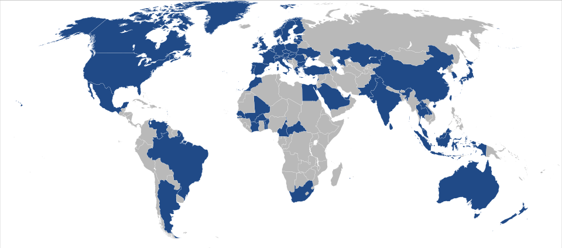
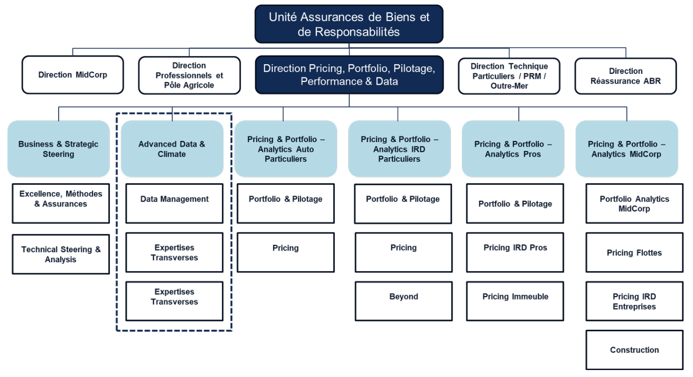

# CHAPITRE 1 — CADRE DE L'ÉTUDE

## 1.1 Présentation d'Allianz France

### Le groupe Allianz : un acteur mondial de l'assurance

Le groupe Allianz a été fondé en 1890 à Berlin et son siège social se trouve aujourd'hui à Munich. Avec plus de 130 ans d'existence, Allianz s'est imposé comme l'un des leaders mondiaux de l'assurance et de la gestion d'actifs. Le groupe est présent dans plus de 70 pays à travers le monde, couvrant l'ensemble des continents : Europe, Amérique du Nord, Europe centrale et orientale, et la région Asie-Pacifique.

L'offre d'Allianz couvre l'ensemble des besoins assurantiels : assurances dommages (automobile, habitation, construction), assurances santé, prévoyance et assurances vie. Le groupe s'adresse aussi bien aux particuliers qu'aux professionnels, entreprises et collectivités. Au-delà de l'assurance, Allianz propose également des produits bancaires au travers de son réseau d'agents, diversifiant ainsi ses activités financières.

### Allianz France : un positionnement fort

*Figure 1.1 : Implantation mondiale du groupe Allianz (Source : Wikimedia Commons, consulté le fév. 2026)*

Aujourd'hui, Allianz France, dont le siège est situé à Paris, est un fournisseur majeur de services financiers spécialisé dans l'assurance et la gestion d'actifs. Avec près de 2 500 points de vente répartis sur le territoire, elle dispose du deuxième plus grand réseau français. L'entreprise emploie environ 11 000 collaborateurs et accompagne plus de 5 millions de clients partout en France. Son offre est particulièrement diversifiée et couvre tous les besoins de la vie quotidienne : assurance automobile, bateau, habitation, construction, santé, prévoyance, assurance vie, retraite, services bancaires et protection juridique.

Les résultats financiers du groupe témoignent de sa solidité. En 2019, Allianz France affichait un chiffre d'affaires compris entre 11 et 12 milliards d'euros, confirmant sa position de leader sur le marché français. Cette performance repose sur la qualité de ses services, son réseau étendu et la diversité de son portefeuille d'activités.

Allianz France s'appuie sur six filiales spécialisées : assurance des grands risques industriels (AGCS), gestion d'actifs (Allianz Global Investors), immobilier (Allianz Real Estate), assurance voyage et assistance (Allianz Global Assistance), et assurance-crédit (Euler Hermes).

---

## 1.2 La direction P4D et le pôle Advanced Data & Climate

### La direction Pricing, Portfolio, Pilotage, Performance & Data (P4D)

Au sein de l'unité Assurances de Biens et de Responsabilités (ABR) d'Allianz France, la direction P4D joue un rôle central dans la définition de la stratégie tarifaire, le pilotage du portefeuille et la gestion des données. Comme son nom l'indique, P4D regroupe quatre dimensions essentielles : le Pricing (tarification), le Portfolio (gestion de portefeuille), le Pilotage (suivi des performances) et la Performance & Data (exploitation des données).

Cette direction structure ses activités autour de plusieurs pôles spécialisés, chacun dédié à un segment de marché ou à une expertise transverse. On y trouve notamment les pôles Pricing & Portfolio pour les différents marchés (Auto, IRD Particuliers, Pros, MidCorp), ainsi que deux pôles transverses : Business & Strategic Steering, et Advanced Data & Climate. C'est au sein de ce dernier qu'a été réalisée la mission présentée dans ce rapport.

*Figure 1.2 : Organigramme de l'unité ABR, direction P4D et pôle Advanced Data & Climate (Source : Stéphane KPOVIESSI, 2025)*

Le pôle ADC regroupe trois activités complémentaires : 
**Data Management** (mise à disposition et maintenance des datamarts par marché), **Expertises Transverses** (modélisations actuarielles et statistiques),
**Expertises Climatiques** (modèles de risque liés au changement climatique). La mission s'est déroulée au sein de l'équipe Data Management, responsable des datamarts Construction, Auto, Habitation, Santé et Épargne qui alimentent les analyses de l'ensemble de la direction P4D.

---

## 1.3 Contexte stratégique : le projet SAS EXIST

Tous les datamarts P&C d'Allianz France fonctionnent aujourd'hui sur une infrastructure SAS en place depuis de nombreuses années. Ce système a bien servi l'entreprise, mais il présente désormais des limites difficiles à ignorer : coûts de licences propriétaires élevés, performances contraintes par des serveurs vieillissants, code difficile à maintenir faute de documentation, et expertise SAS de plus en plus rare sur le marché du travail. Pendant ce temps, Python et l'écosystème cloud sont devenus les standards du data engineering.

C'est dans ce contexte qu'Allianz France a lancé en 2024 le projet **SAS EXIST** (SAS Exit Strategy) : une migration progressive de l'ensemble des datamarts vers Azure Databricks et PySpark. La migration se fait marché par marché, en commençant par un prototype pilote qui devra valider la démarche technique et poser les bases méthodologiques pour les migrations suivantes.

---

## 1.4 Problématique et objectifs de la mission

La mission confiée consistait à réaliser ce premier prototype sur le **datamart Construction** (marché 6), choisi pour sa complexité représentative sans être excessive. La problématique centrale était la suivante :

> *Comment migrer le datamart Construction de SAS vers PySpark en garantissant une parité fonctionnelle stricte et en construisant une architecture réutilisable pour les migrations futures ?*

Cette problématique engage quatre dimensions :

- **Technique** : comprendre et transposer environ 15 000 lignes de code SAS non documenté, réparties sur dix-neuf fichiers ;
- **Architecturale** : concevoir une architecture médaillon (Bronze / Silver / Gold) adaptée aux spécificités du marché Construction et généralisable aux autres marchés ;
- **Qualité** : valider que les sorties Python sont strictement identiques aux sorties SAS de référence, sur plusieurs périodes ;
- **Documentation** : produire des livrables durables, documentation SAS, règles métier, code Python, qui serviront de référence aux équipes après le stage.

Le succès de ce prototype conditionne directement la suite du programme SAS EXIST : si la faisabilité est démontrée, les quatre marchés restants pourront être migrés selon la même méthodologie.
