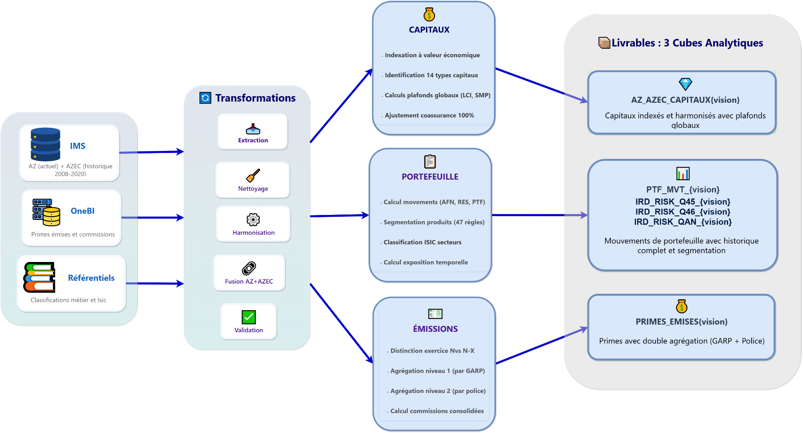
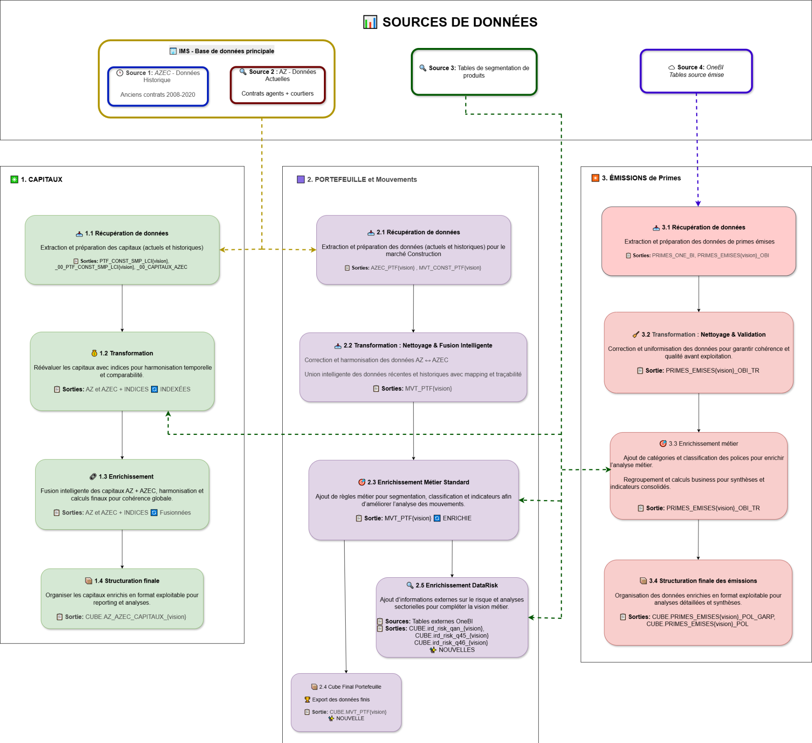
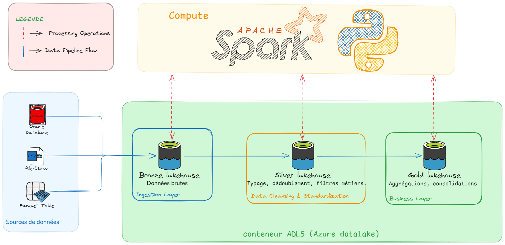

# CHAPITRE 2 — CONTEXTE TECHNIQUE ET ÉTAT DE L'ART

## 2.1 L'existant : le datamart Construction en SAS

### 2.1.1 Rôle du datamart Construction dans l'analyse assurantielle

Le datamart Construction constitue l'un des cinq datamarts P&C gérés par l'équipe Data Management d'Allianz France. Il agrège et structure l'ensemble des données relatives au marché de l'assurance construction, qui couvre les risques liés aux bâtiments, travaux et chantiers. Ce marché présente des spécificités métier importantes : les capitaux assurés sont généralement élevés, les sinistres peuvent être complexes et s'étaler sur plusieurs années, et l'indexation des capitaux en fonction de l'inflation dans le secteur de la construction est cruciale.

Le datamart Construction alimente trois types d'analyses principales. Les **études de portefeuille** permettent de suivre l'évolution du nombre de polices, les mouvements d'affaires nouvelles et de résiliations, et la composition du portefeuille par segment de clientèle (agents, courtiers, entreprises de construction). Les **analyses de capitaux** portent sur l'évaluation de l'exposition au risque à travers les capitaux assurés (Sinistre Maximum Possible, Limite Contractuelle d'Indemnité, Perte d'Exploitation, Risque Direct) et leur indexation selon les indices de coût de construction de la Fédération Française du Bâtiment. Enfin, les **calculs de primes** agrègent les émissions de primes par police et par garantie pour alimenter les reportings financiers et réglementaires.

Les utilisateurs principaux de ce datamart sont les actuaires de la direction P4D, les équipes de pricing qui calibrent les tarifs commerciaux, les contrôleurs de gestion qui suivent la rentabilité du marché, et les équipes de pilotage qui produisent les reportings pour la direction générale et les autorités de régulation. La disponibilité et la fiabilité de ce datamart sont donc critiques pour le fonctionnement quotidien de l'entreprise.

La figure 2.1 ci-dessous illustre la vue d'ensemble du datamart Construction en SAS : les trois sources de données principales (IMS pour le portefeuille AZ et AZEC, OneBI pour les émissions, et les référentiels métier) alimentent trois pipelines distincts produisant trois cubes analytiques finaux.

*Figure 2.1 — Vue d'ensemble de l'architecture du datamart Construction : sources de données, transformations et cubes analytiques produits (Source : documentation interne Allianz France, 2024)*

### 2.1.2 Architecture actuelle en SAS

L'implémentation actuelle du datamart Construction repose sur une architecture SAS développée progressivement sur plusieurs années. Le code est réparti sur **dix-neuf fichiers SAS** totalisant environ quinze mille lignes de code. Ces fichiers sont organisés selon une logique séquentielle : chaque fichier réalise une étape de transformation spécifique et produit des tables intermédiaires qui servent d'entrée au fichier suivant.

L'architecture SAS suit un modèle monolithique où toutes les transformations sont enchaînées dans un flux linéaire. Les données brutes, stockées sous forme de fichiers CSV sur des serveurs partagés, sont lues par les premiers fichiers SAS qui appliquent des filtres métier de base (marché Construction, exclusion des polices annulées). Les fichiers suivants enrichissent progressivement ces données : extraction des capitaux depuis des champs texte, calculs des mouvements de portefeuille, jointures avec des tables de référence (nomenclatures NAF, codes ISIC, données IRD), calculs d'indexation, et enfin agrégation pour produire les tables finales.

Comme le montre la figure 2.2, l'architecture détaillée du datamart décompose les traitements en trois pipelines indépendants. Le **pipeline Capitaux** (partie gauche) extrait les capitaux historiques et actuels, applique l'indexation à valeur économique par rapport aux indices FFB, puis consolide les données AZ et AZEC en un cube final. Le **pipeline Portefeuille et Mouvements** (partie centrale) réalise l'extraction des données de portefeuille, le nettoyage et l'harmonisation des structures AZ/AZEC, la fusion intelligente des deux canaux de distribution, l'enrichissement métier (segmentation produits, indicateurs AFN/RES, codes ISIC), et enfin l'enrichissement DataRisk pour produire les cubes PTF finaux. Le **pipeline Émissions** (partie droite) centralise les données One BI, applique un nettoyage et une validation, réalise la segmentation et la classification produits, et agrège les primes par police et par garantie.

*Figure 2.2 — Architecture détaillée des flux de données : sources, transformations par étape et tables de sortie des trois pipelines du datamart Construction (Source : documentation interne Allianz France, 2024)*

Cette architecture présente plusieurs caractéristiques techniques notables. Le **code SAS utilise massivement les macros**, mécanisme permettant de générer dynamiquement du code SAS. Certaines macros sont imbriquées sur plusieurs niveaux, rendant la lecture du code complexe et nécessitant de dérouler mentalement l'ensemble des substitutions pour comprendre la logique réelle. Les **variables globales** sont utilisées pour partager des paramètres entre différents fichiers (chemins de données, période de traitement, codes métier), mais leur portée n'est pas toujours clairement documentée. Enfin, **l'absence de documentation initiale** oblige à une lecture exhaustive du code pour comprendre l'ensemble des traitements.

Le processus d'exécution est séquentiel : les dix-neuf fichiers doivent être lancés dans un ordre précis, chaque fichier attendant que le précédent ait terminé avant de démarrer. Cette séquentialité limite les possibilités d'optimisation et allonge les temps de traitement globaux.

### 2.1.3 Limites de l'architecture SAS existante

Au-delà des limites stratégiques évoquées dans le chapitre un (coûts de licences, raréfaction de l'expertise, performances limitées), l'architecture SAS présente plusieurs contraintes techniques qui ont motivé la décision de migration.

**La scalabilité est structurellement limitée.** SAS exécute les traitements sur un seul serveur de calcul. Lorsque les volumes de données augmentent ou que de nouveaux enrichissements sont ajoutés, les temps de traitement s'allongent proportionnellement. Il n'existe pas de mécanisme simple pour paralléliser les calculs ou distribuer la charge sur plusieurs machines.

**La maintenabilité du code est coûteuse.** La complexité du code SAS, avec ses macros imbriquées et ses variables globales, rend les évolutions risquées. Lorsqu'une règle métier doit être modifiée, il faut tracer l'ensemble des endroits où cette règle intervient en tenant compte des substitutions de macros. Le risque d'effets de bord est élevé, et chaque modification nécessite des tests exhaustifs sur plusieurs visions.

**L'absence de séparation des responsabilités** complique le débogage et les tests. Dans l'architecture SAS, un même fichier peut mélanger la lecture des données, les filtres métier, les transformations, les jointures et l'écriture des résultats. Lorsqu'un problème survient, il est difficile d'isoler la cause exacte du dysfonctionnement.

**La gestion des versions et de la traçabilité est rudimentaire.** Le code SAS est stocké sur des répertoires partagés, sans système de gestion de versions moderne. Les commentaires dans le code sont rares et souvent obsolètes, rendant difficile la reconstitution de l'historique des modifications.

Ces limites techniques, combinées aux enjeux stratégiques de coûts et d'expertise, ont conduit à la décision de migrer vers une architecture moderne basée sur PySpark et Azure.

---

## 2.2 Technologies modernes pour le traitement de données

### 2.2.1 PySpark et Apache Spark

**PySpark** est l'interface Python d'Apache Spark. L'API de DataFrames qu'elle expose permet de manipuler des volumes massifs de données en distribuant les calculs sur un cluster de machines, une capacité absente de l'architecture SAS d'origine. PySpark supporte nativement les opérations SQL, les agrégations complexes, les jointures et les fonctions fenêtres (*window functions*), couvrant ainsi tous les besoins de transformation du datamart Construction.

Pour ce projet, PySpark présente trois avantages décisifs : la compatibilité avec les formats modernes (Parquet, Delta, CSV), la possibilité d'exécuter le même code en local pour les tests et sur un cluster Databricks en production, et l'intégration native avec l'écosystème Azure.

### 2.2.2 Azure Databricks

**Azure Databricks** est une plateforme cloud managée qui fournit un environnement complet pour exécuter des workloads Spark : clusters gérés automatiquement, notebooks collaboratifs, intégration native avec Azure Data Lake Storage (ADLS) et support de Delta Lake. Le choix d'Azure Databricks s'aligne avec la stratégie du groupe Allianz, qui a standardisé ses infrastructures data sur Azure au niveau international (ZDNet France, 2025). Cette convergence facilite le partage de bonnes pratiques entre les entités du groupe.

### 2.2.3 Formats de stockage modernes

**Parquet** est un format de fichier binaire optimisé pour le stockage en colonnes. Il offre une compression efficace et des performances de lecture supérieures au CSV traditionnel, particulièrement pour les requêtes portant sur un sous-ensemble de colonnes. Dans le contexte du datamart Construction, le passage de CSV à Parquet permet de réduire significativement l'espace de stockage et d'accélérer les lectures.

**Delta Lake**, extension de Parquet, ajoute des fonctionnalités de gestion de données avancées : transactions ACID (garanties de cohérence et d'intégrité), *time travel* (accès aux versions historiques des données), et gestion de schéma avec évolution contrôlée. Ces fonctionnalités améliorent la qualité et la traçabilité des données, répondant à des exigences réglementaires croissantes dans le secteur de l'assurance.

### 2.2.4 L'architecture médaillon : standard de l'industrie

L'**architecture médaillon** (*medallion architecture*) est un pattern d'organisation des données popularisé par Databricks et adopté comme standard de l'industrie pour les architectures *lakehouse*. Elle organise les données en trois couches successives, chacune représentant un niveau croissant de qualité et de transformation.

Comme l'illustre la figure 2.3, les données transitent de la couche Bronze vers la couche Silver, puis vers la couche Gold, en suivant un flux unidirectionnel traité par Apache Spark et Python.

*Figure 2.3 — Architecture médaillon implémentée : flux de données des sources vers les couches Bronze, Silver et Gold stockées dans Azure Data Lake Storage (ADLS), traitées par Apache Spark et PySpark (Source : documentation interne Allianz France, 2024)*

La **couche Bronze** constitue la zone d'ingestion brute. Les données y arrivent directement depuis les sources (fichiers CSV exportés des systèmes opérationnels, tables One BI) sans aucune transformation. Chaque fichier est stocké tel quel, partitionné par année et par mois. Cette couche est immuable : elle conserve une trace fidèle de toutes les données reçues, permettant de rejouer n'importe quel traitement depuis la source en cas de correction.

La **couche Silver** est la couche de transformation métier. Les données brutes de Bronze y sont nettoyées (correction des encodages, standardisation des types de données, gestion des valeurs nulles), filtrées selon les règles métier (marché Construction, exclusion des polices annulées), et enrichies (calculs des mouvements AFN/RES/PTF, extraction des capitaux, calculs d'indexation). Le format Parquet est utilisé pour cette couche, garantissant des performances optimales pour les lectures ultérieures.

La **couche Gold** est la couche de consommation finale. Elle contient les données consolidées, prêtes pour l'analyse et la Business Intelligence. Pour le datamart Construction, la couche Gold réalise notamment la fusion des données AZ et AZEC, les enrichissements complets (IRD Risk, données clients, codes ISIC), et produit les trois cubes analytiques finaux (PTF_MVT, AZ_AZEC_CAPITAUX, PRIMES_EMISES).

Le tableau 2.1 synthétise les différences principales entre l'architecture SAS existante et l'architecture médaillon cible :

*Tableau 2.1 — Comparaison des architectures SAS et PySpark sur les principaux critères*

| **Critère** | **SAS (Existant)** | **PySpark / Architecture médaillon (Cible)** |
|---|---|---|
| **Architecture** | Monolithique, flux linéaire | Distribuée, couches Bronze/Silver/Gold |
| **Licences** | Propriétaires (coûteuses) | Open Source (gratuit) |
| **Scalabilité** | Limitée (serveur unique) | Élevée (cluster élastique Azure) |
| **Configuration** | Codée en dur dans les scripts | Externalisée (JSON/YAML) |
| **Performance** | Séquentielle, sur disque | Parallèle, en mémoire (in-memory) |
| **Format de stockage** | SAS7BDAT / CSV | Parquet optimisé (colonnaire) |
| **Versioning du code** | Absence de VCS | Git (traçabilité complète) |
| **Maintenabilité** | Macros imbriquées, difficile | Modules Python découplés et testables |
| **Traçabilité** | Minimale | Logs détaillés par couche et par étape |
| **Reproductibilité** | Partielle | Complète (rejeu depuis Bronze) |

Ce tableau comparatif confirme que la migration vers PySpark et l'architecture médaillon répond directement aux limites structurelles identifiées dans l'architecture SAS existante.

---

## 2.3 Revue bibliographique et état de l'art des migrations SAS vers Python

### 2.3.1 Tendances de migration dans l'industrie

La migration des infrastructures SAS vers des technologies open source est une tendance de fond observée dans de nombreux secteurs, en particulier dans les services financiers et l'assurance. Les principales motivations identifiées sont la réduction des coûts de licences, la montée en popularité de Python auprès des nouvelles générations de data scientists, et l'adoption généralisée du cloud computing (Numeum, 2024).

Dans le secteur de l'assurance spécifiquement, les contraintes réglementaires (Solvabilité II, IFRS 17) ont conduit les acteurs à moderniser leurs chaînes de traitement de données pour améliorer la traçabilité, l'auditabilité et la reproductibilité des calculs actuariels. L'architecture médaillon, telle que décrite par Databricks (2024), répond précisément à ces exigences en garantissant une séparation claire entre les données brutes, les transformations intermédiaires et les résultats finaux.

### 2.3.2 Défis techniques connus

La littérature technique identifie plusieurs défis récurrents lors des migrations SAS vers Python. La **gestion des valeurs nulles** est l'un des plus fréquemment cités : SAS représente les valeurs manquantes numériques par un point (.) et les valeurs textuelles par une chaîne vide (""), tandis que Python/PySpark utilise la valeur `null`. Cette différence de convention, si elle n'est pas traitée explicitement, peut conduire à des erreurs silencieuses dans les calculs.

La **compatibilité des formats de dates** est un autre défi documenté : SAS stocke les dates en formats spécifiques (numéro de jours depuis le 1er janvier 1960, ou chaînes de caractères comme "14MAY1991:00:00:00") qui nécessitent des fonctions de conversion explicites en PySpark. Les **macros SAS** n'ont pas d'équivalent direct en Python et doivent être refactorisées en fonctions Python paramétrables, ce qui constitue souvent la partie la plus complexe de la migration.

Enfin, la **validation de la parité fonctionnelle** est reconnue comme une étape critique et chronophage. La comparaison des résultats SAS et Python ligne par ligne, indicateur par indicateur, nécessite une méthodologie rigoureuse et un outillage adapté (Armbrust et al., 2020).

### 2.3.3 Bonnes pratiques identifiées

Les retours d'expérience disponibles convergent autour de plusieurs bonnes pratiques pour mener à bien une telle migration. La **documentation exhaustive du code source** avant de commencer à coder est unanimement identifiée comme un prérequis indispensable, particulièrement lorsque le code SAS n'est pas documenté initialement. Le **recensement systématique des règles métier** dans un format structuré (tableur ou base de données) permet de garantir l'exhaustivité de la migration et de fournir une base pour les tests de validation.

L'**adoption d'une architecture modulaire** facilite les tests unitaires et la maintenance. La **séparation de la configuration et du code** (externalisation des règles métier dans des fichiers JSON ou YAML) rend le code plus lisible et plus facilement évolutif. Enfin, la **validation incrémentale** tester chaque module immédiatement après son implémentation permet de détecter et corriger les erreurs au plus tôt, évitant l'accumulation de bugs difficiles à tracer (Zaharia et al., 2010).

Ces bonnes pratiques ont directement inspiré la méthodologie adoptée pour la migration du datamart Construction, détaillée dans le chapitre suivant.
