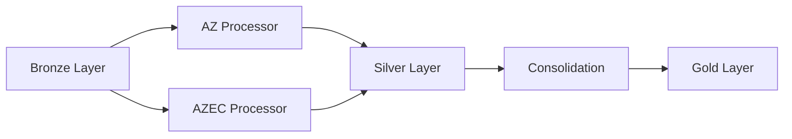

# Capitaux Workflow

## Purpose

Processes construction insurance capital data with indexation to produce:
- Indexed capital amounts (SMP, LCI, PE, RD)
- RC limits (per claim and per year)
- Company share calculations

---

## Pipeline Overview

**Stages:**
1. **AZ Processor** → Extract and index capitals from IPF files
2. **AZEC Processor** → Aggregate capitals from CAPITXCU + INCENDCU
3. **Consolidation** → Merge AZ + AZEC with harmonized schema

---

## Input Sources

| Source | File Pattern | Layer | Description |
|--------|-------------|-------|-------------|
| IPF Agent | `*IPFE16_IPF_*.csv.gz` | Bronze/monthly | Agent policies (14 capital fields) |
| IPF Courtage | `*IPFE36_IPF_*.csv.gz` | Bronze/monthly | Courtage policies (14 capital fields) |
| CAPITXCU | `capitxcu.csv` | Bronze/ref | AZEC capitals by branch |
| INCENDCU | `incendcu.csv` | Bronze/ref | AZEC PE/RD amounts |
| SEGMPRDT | `segmentprdt_*.csv` | Bronze/ref | Product segmentation |
| Indices | `indices.csv` | Bronze/ref | Construction cost indices |

---

## Capital Extraction

### AZ Channel (Keyword-Based)

Searches through `LBCAPI1-14` for keywords:

| Capital | Keywords |
|---------|----------|
| **SMP_100** | "SMP GLOBAL", "SMP RETENU", "SINISTRE MAXIMUM POSSIBLE" |
| **LCI_100** | "LCI GLOBAL", "CAPITAL REFERENCE", "LIMITE CONTRACTUELLE" |
| **PERTE_EXP** | "PERTE D'EXPLOITATION", "PERTES D'EXPLOITATION" |
| **RISQUE_DIRECT** | "RISQUE DIRECT", "DOMMAGES DIRECTS" |
| **RC_PAR_SIN** | "DOMMAGES CORPORELS" |
| **RC_PAR_AN** | "TOUS DOMMAGES CONFONDUS" |

### AZEC Channel (Structured)

| Source | Field | Mapping |
|--------|-------|---------|
| CAPITXCU | LCI + IP0 | LCI_PE_100 |
| CAPITXCU | LCI + ID0 | LCI_DD_100 |
| CAPITXCU | SMP + IP0 | SMP_PE_100 |
| CAPITXCU | SMP + ID0 | SMP_DD_100 |
| INCENDCU | MT_BASPE | PERTE_EXP_100 |
| INCENDCU | MT_BASDI | RISQUE_DIRECT_100 |

---

## Key Calculations

### Indexation (AZ Only)

**Formula:** `Capital_IND = Capital × (Target_Index / Origin_Index)`

- Origin Index: From contract start date (DTEFSITT)
- Target Index: From anniversary date in current year
- Index source: `indices.csv` or PRPRVC fallback

### Normalization to 100% Basis

**Formula:** `Capital_100 = (Capital × 100) / PRCDCIE`

Applied to all capitals to convert from company share.

### Business Rules

| Rule | Formula |
|------|---------|
| SMP Completion | `SMP = MAX(SMP, SMP_PE + SMP_RD)` |
| RC Limit | `LIMITE_RC = MAX(RC_PAR_SIN, RC_PAR_AN)` |
| Value Insured | `VALUE_INSURED = PERTE_EXP + RISQUE_DIRECT` |

---

## Output Datasets

### Silver Layer (Intermediate)

| # | Dataset | Rows | Description |
|---|---------|------|-------------|
| 1 | `az_capitaux_{vision}` | ~68K | AZ indexed capitals |
| 2 | `azec_capitaux_{vision}` | ~12K | AZEC capitals |

### Gold Layer (Final)

| # | Dataset | Rows | Description |
|---|---------|------|-------------|
| 3 | `az_azec_capitaux_{vision}` | ~80K | Consolidated capitals |

---

## Output Schema (az_azec_capitaux)

### Identifiers
- `nopol` - Policy number
- `cdprod` - Product code
- `cdpole` - Distribution channel (1=Agent, 3=Courtage)
- `dircom` - Commercial direction ('AZ' or 'AZEC')

### Segmentation
- `cmarch` - Market code (6 = Construction)
- `cseg`, `cssseg` - Segment codes

### Indexed Capitals (100% Basis)
- `smp_100_ind`, `lci_100_ind`
- `perte_exp_100_ind`, `risque_direct_100_ind`
- `value_insured_100_ind`
- `limite_rc_100_ind`, `limite_rc_100_par_sin_ind`, `limite_rc_100_par_an_ind`

### Non-Indexed Capitals (AZ Only)
- `smp_100`, `lci_100`
- `perte_exp_100`, `risque_direct_100`
- `value_insured_100`, `limite_rc_100`

### Company Share (AZEC Only)
- `smp_cie`, `lci_cie`
